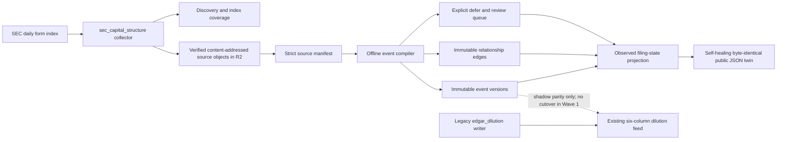

# Capital Structure Intelligence — Wave 0–2A operating contract

Status: implemented evidence spine plus observed-filing-state projection, context-only
Owner: `capital-structure-intelligence`
Canonical build docket: `research/CAPITAL_STRUCTURE_INTELLIGENCE_COMPETITIVE_TEARDOWN_AND_BUILD_DOCKET_2026-08-01.md`

## Ruling

Capital Structure Intelligence is a shared SEC evidence and issuer-context plane, not a
screen-scraped clone and not a second dilution score. Wave 0–1 establishes source truth,
immutable event history, point-in-time replay, and a compatibility boundary around the
existing `data/edgar/dilution_events.parquet` feed. Wave 2A adds a public-safe projection
of observed filing state. It grants no rank, entry, sizing, veto, or Prophet authority.

The temporary canonical event adapter is `capital_structure.event.v1`. The repository does
not yet contain the proposed generic `company_event.v1`; silently claiming that namespace
would create a second generic company-event truth plane. The migration owner is
`capital-structure-intelligence`, with a review date of 2026-10-01. Migration must preserve
event IDs or publish explicit supersession edges and PIT receipts.

## Data flow and ownership

| Artifact | Sole producer | Role |
|---|---|---|
| `data/capital_structure/discovery.parquet` | `collectors/sec_capital_structure.py` | Keep-first daily-index discovery |
| `data/capital_structure/index_coverage.parquet` | same | Per-index-day complete/retry/not-published ledger; only a structurally valid index can close a zero-target day |
| `data/capital_structure/retrieval_attempts.parquet` | same | Retryable operational attempts; failures never become source manifests |
| `data/capital_structure/source_manifest.parquet` | same | Strict pointers to hash-verified source bytes |
| R2 `capital_structure/sec/sha256/<prefix>/<sha256>` | same | Unlinked raw complete submissions and selected primary/EX-3/EX-4/EX-10/EX-99 public SEC evidence |
| `data/capital_structure/event_versions.parquet` | `scripts/compile_capital_structure_events.py` | Immutable `capital_structure.event.v1` versions |
| `data/capital_structure/event_edges.parquet` | same | Immutable amends/effectuates/withdraws/supersedes edges |
| `data/capital_structure/review_queue.parquet` | same | Rebuildable ambiguity/linkage work queue |
| `data/capital_structure/telemetry.json` | same | Coverage, exclusions, failures, migration, and authority receipt |
| `data/capital_structure/projection.json` | `scripts/build_capital_structure_projection.py` | Canonical public-safe observed-filing-state bundle |
| `site/capital-structure-data/latest.json` | same | Byte-identical static read twin after each successful build or startup recovery |
| `data/edgar/dilution_events.parquet` | `collectors/edgar_dilution.py` | Existing legacy feed; unchanged in Wave 1 |

The collector runs inside the serial SEC host group. The compiler runs immediately after
collection and before the nightly data checkpoint. Render workflows never fetch SEC or
compile the spine.

The projection writer replaces each output atomically and ordinarily rolls both files back
if either replace fails. The two paths are not one cross-file filesystem transaction: a hard
process stop can land between replaces. Every subsequent invocation therefore validates both
copies before reading the current source generation and deterministically heals a missing,
invalid, or older public copy from the valid canonical copy (or restores a missing canonical
copy from the valid public twin). If neither copy is valid, it fails closed. Successful and
recovered steady state is byte-identical; the contract does not claim crash-atomic twins.

## Source-truth law

A source-manifest row exists only after the original bytes are written to the object store,
read back, and matched to the expected SHA-256. Missing credentials, failed writes, and
failed readback are explicit failures in the attempts ledger. Retained unsupported or
suspect content carries an explicit parser eligibility and corruption state and compiles to
a defer state. None of these states may become “no financing” or a valid empty filing.
Manifest retrieval and first-seen clocks are stamped once the entire selected filing bundle
has completed verified readback, never at request start.

The raw-object key is derived only from the content hash. The same URL returning different
bytes therefore creates another immutable object instead of overwriting history. Complete
submission bytes are retained alongside the primary document and capital-term-bearing
exhibits. SEC evidence is public, but manifests still mark `contains_personal_data=true`
because filings routinely contain named officers, directors, and signatures. Every
downstream observation must carry a manifest ID and exact span hash. Instrument-term
evidence also propagates source rights, privacy, and a strict publication disposition; raw
evidence excerpts are capped at 500 characters, and public excerpts require explicit
excerpt permission and personal-data redaction.

`manifest_id` is `manifest:cs:<sha256>` over the canonical full manifest body with only
the ID field itself omitted. Existing ledgers are identity-validated as an immutable ordered
prefix before append; an identity mismatch, duplicate prior ID, or same-ID body divergence
fails closed instead of being hidden by dataframe deduplication.

Before publishing any generation, the compiler resolves every persisted and newly produced
event `source.manifest_ids` and every evidence `manifest_id` against the current source
manifest ledger. A truncated or valid-but-empty source ledger therefore cannot preserve old
events while publishing a green orphaned generation; compilation fails and the prior
telemetry-last generation remains untouched. Manifest IDs commit to each row's full
canonical body, and identity validation plus global duplicate-ID rejection runs before
accession grouping.

Every manifest also records a stable, non-secret `storage.store_id` namespace:
`capital_structure_local`, `r2_capital_structure`, `r2_research`, or `r2_shared`. This
preserves which configured store class owned the object at write time without publishing a
bucket name, endpoint, access key, or secret. Consumers resolve the namespace through
deployment configuration; `storage.object_key` alone is not treated as globally resolvable.
Changing the physical bucket behind an existing `store_id` requires a verified copy and
migration receipt first; an existing namespace must never be silently rebound.

## Event and graph law

Events are immutable versions. Corrections create a new event ID and point backward; they
do not edit the original row. Registration relationships live in a separate edge table so a
later EFFECT or withdrawal cannot mutate an older registration. Each accession compiles
only from its latest closed bundle version; documents that belonged only to an older bundle
cannot leak into the replacement bundle.

The graph engine can use, in order:

1. an explicitly referenced accession supplied by reviewed deterministic linkage metadata;
   or
2. an exact CIK + SEC file number + registration family + prior chronology match.

Wave 1 source manifests do not yet extract referenced accessions from filing prose, so the
nightly compiler currently uses only the second path. Anything non-unique becomes
`deferred_linkage` in the graph review queue. A relationship form remains a classified
immutable filing-state event; linkage resolution is separate graph truth and never leaves
a successfully linked canonical event mislabeled as deferred. Only registration statements
and their amendments are eligible relationship parents, so an intervening prospectus cannot
capture a later amendment, EFFECT, or withdrawal edge merely by sharing a file number.
If the publicly earlier parent is retained after its child, the edge resolves only at the
later system-retention clock; it is never backdated to the child's earlier observation.
Once published, a child event version's lifecycle edge is immutable: a parent correction is
reached through its `supersedes` chain rather than retargeting or duplicating that edge. A
child correction is a new event version and can link to the latest visible parent version.
Prospectuses, 6-Ks, broad 8-Ks, and proxy forms that cannot be
classified safely from form metadata become content-deferred rather than being guessed.
Deterministic form routing may establish a filing-state candidate; it does not normalize
financing terms.

## Point-in-time law

Two clocks are mandatory:

- `public_available_at`: the SEC acceptance timestamp, or null when unavailable;
- `system_available_at`: Mastermind's keep-first observation timestamp.

Canonical `available_at` equals `system_available_at`, which is the latest first-seen clock
among every manifest in the selected closed evidence bundle. A primary or exhibit retained
later can never borrow the complete submission's earlier clock. A 2020 filing first
backfilled in 2026 is therefore invisible to a canonical 2020 replay. Historical research
may explicitly request public-clock mode, but must label it; it may never substitute
filing-date midnight for a missing acceptance timestamp. Legacy SGML
`ACCEPTANCE-DATETIME` is interpreted on the SEC Eastern clock (daylight or standard as
applicable) and normalized to UTC. A parser correction becomes available when produced,
not retroactively at the original filing time.

The compiler stages all outputs outside `data/capital_structure`, validates their serialized
contracts, promotes telemetry last, and hashes all three parquet artifacts into that commit
marker. Every later compile verifies the marker before trusting persisted ledgers; a partial
or tampered generation fails closed instead of becoming the next baseline. The marker also
contains an immutable source-ledger receipt: ordered record count, canonical prefix SHA-256,
and form-policy version. Its generation ID binds that receipt together with output hashes.
New source rows may append after a checkpoint, but truncation, mutation, or reordering inside
the committed prefix fails closed. A policy-version bump may consume a valid old-policy
prefix and stamps the newly compiled generation with the current policy version.
`status=ok` is
reserved for a zero-failure generation. Any accession-level schema, bundle, or compile
failure produces an in-memory `status=degraded` receipt with null artifact hashes and aborts
publication; it cannot overwrite a previously verified generation or pass the nightly data
checkpoint. `status=no_source_manifest` is valid only before any governed artifacts exist.

## Wave 1 form coverage

Collected now:

- S-1/F-1/S-3/F-3/F-10 registrations and amendments, including ASR variants;
- EFFECT, POS AM/POSASR, RW/RW-A, and AW/AW-A state documents;
- 424B1/B3/B4/B5/B7/B8 prospectuses;
- Reg-A 1-A, 1-A/A, 1-A POS, 1-K, 1-K/A, 1-U, and 253G1–G4 documents.

Declared but not claimed as collected in this wave: broad 8-K/8-K-A, 6-K/6-K-A, proxy,
10-Q/10-K, 20-F, and 40-F reconciliation; plus known capital-relevant families including
S-8, S-11, S-4/F-4, F-6, N-2, S-3D/F-3D, legacy 424B6, 424H/I, and blanket 424B2.
The 424B2 structured-note population is too large for defensible blanket collection and
remains a targeted-later family pending an explicit relevant-issuer universe; W1 does not
invent that universe. Existing ownership and 13F collectors remain the authority for their
own context families. Telemetry publishes both exclusion sets and labels coverage as an
explicit allowlist, so “Wave 1” cannot be presented as all-registration, all-issuance, or
all-SEC completeness.

The daily-index bootstrap is bounded to 90 calendar days. Nightly runs inspect a seven-day
window plus every outstanding retry date, including failures that have aged beyond seven
days; terminal rows stamped under an older form-policy version are also revalidated. The
Adapter `full_history` flag revalidates the bounded 90-day bootstrap window; it is
not a historical EDGAR backfill. Historical PIT backfill remains later work. Historical
index objects become terminal `not_published` only for deterministic observed US federal
holiday closures or after they are at least seven days old and return HTTP 404 on
consecutive runs. HTTP 403 is never missing-index evidence because SEC also uses it for
rate limiting and IP blocks. Recent or first-observed 404s, malformed 200 responses, HTML
error bodies, generic 403s, and transient failures stay retryable.

## Legacy compatibility and cutover

`engine/capital_structure/legacy.py` implements the exact six-column projection contract:

`accession, cik, ticker, form, filing_date, _first_seen`

It preserves seed rows and nulls, admits only the old S-3/S-3ASR/S-3-A/424B1–B5 universe,
and requires explicit post-cutover first-seen timestamps. The projector accepts the original
flat fixtures, strict canonical event objects, exact event-ledger rows carrying `event_json`,
and nested filing/issuer/point-in-time columns; every path emits the same exact six-column
shape. It is shadow-only in Wave 1. The old collector remains the sole network writer until
at least seven successful nightly parity comparisons and explicit cutover adjudication. A
new historical backfill must never be injected retroactively into Bottom Sensors or
falsifier histories.

## Authority firewall

The event, issuer-context, and compiler-telemetry contracts hard-code context-only,
rank=false, sizing=false, entry=false, and Prophet=false authority. Source manifests and
term observations contain evidence and provenance rather than an authority object; their
closed schemas reject undeclared authority fields, and canonical extraction methods exclude
LLM-originated truth. Wave 0–1 cannot:

- modify Prophet signals, labels, ordering, confidence, entry, or sizing;
- originate an offering-probability score;
- convert missing evidence to zero;
- let an LLM originate classification truth, financing terms, or risk escalation; or
- expose user-facing severity claims before the later calibration and product-surface gates.

The front-end product and Mastermind/Neural Web projection consume a later issuer-context
artifact. They do not read raw evidence or invent a second calculation path.

## Wave 2A observed-filing-state projection

`scripts/build_capital_structure_projection.py` runs immediately after the offline event
compiler. It verifies the compiler's telemetry-last artifact hashes and append-only source
receipt before reading any event, edge, or review row. A corrupt, partial, or mismatched
generation fails closed and cannot replace the last published projection. With an explicit
`no_source_manifest` or degraded no-artifact receipt, the pure projection contract renders
`unavailable`; it never renders an empty green state.

The projection groups records by canonical SEC issuer ID / CIK rather than ticker, filters
event versions on canonical Mastermind system availability, and admits relationship edges
only after each edge's own observation clock. Each event preserves three clocks separately:
SEC acceptance, Mastermind first observation, and projection generation. It exposes public
SEC URLs plus bounded manifest/span/hash references, never raw retained documents, R2 object
keys, bucket names, or filing text.

This is deliberately titled **Observed filing state**. Registration, amendment, EFFECT,
withdrawal, and deferred prospectus observations are document-state facts. They are not
claims about issuance, offering ability, remaining capacity, instruments, fully diluted
shares, cash runway, overhang, risk severity, or financing probability. Those capabilities
remain explicit `unavailable` values until their separately versioned term, instrument,
calculation-receipt, and issuer-state ledgers pass reconciliation gates.

## Promotion gates

Implemented and CI-pinned in Wave 0–1:

- strict Draft 2020-12 contracts for source manifests, events, event edges, term
  observations, issuer context, review items, and compiler telemetry;
- content-addressed write/readback verification and storage-failure defer behavior;
- deterministic form routing and stable source-span hashing;
- immutable corrections and graph edges, with a strict immutable migration receipt;
- canonical/public dual-clock replay tests;
- exact legacy projection tests and render-network firewall tests;
- Synapse registry ownership for the canonical artifacts.

Still blocking normalized terms, issuer state, probability engines, Prophet integration,
and the full public dossier UI:

- the adjudicated 200-event real-filing golden corpus is not yet complete;
- term extraction and reconciliation need precision/recall and contradiction gates;
- legacy shadow parity needs seven real nightly observations;
- risk models need pre-registered labels, calibrated probabilities, OOS evaluation, and
  promotion through the existing house gauntlet;
- numerical UI lanes require the issuer-context compiler and their own
  freshness/reconciliation disclosures; Wave 2A permits only observed filing state.

No later wave may describe these blocked capabilities as live merely because the schemas or
dashboard placeholders exist.
