# Signal Bus — Artifact Registry

The **signal bus** is the set of cross-engine data artifacts that flow between producers and consumers inside the Macro Dashboard engine. Each artifact is the single authoritative output of one producer (a script or engine module); every downstream reader — whether another engine module, a site-build script, or an external system — is listed explicitly. The registry lives in `config/synapse.yml` and is the single source of truth: it records each artifact's path, format, freshness SLA, storage backend, tier on the qualification ladder, and full consumer list derived from the W0 census (workflow wf_67ace3c1 + wf_dd79661a red-team, 2026-07-04). In W0 the registry is **passive** — it names what exists; read-gating and envelope stamping follow in W1 and W2.

> generated from `config/synapse.yml` — do not edit by hand; regenerate with `python -m scripts.gen_signal_bus_doc`

## Summary

### Artifacts by owner_program

| owner_program | count |
|---|---|
| active-build-map | 1 |
| btc-vector | 5 |
| china-alpha | 7 |
| china-intel-hub | 2 |
| codex-b5 | 1 |
| codex-docket-b6 | 3 |
| cycle-intelligence | 14 |
| dannytrades | 1 |
| engine-fix | 16 |
| entry-stack-expansion | 2 |
| factor-intelligence | 5 |
| hk-canada | 2 |
| institutional-sector-intelligence | 2 |
| intl-fix | 1 |
| long-hold | 28 |
| macro-release-intel | 5 |
| mastermind-feedback-contract | 2 |
| momoedge | 8 |
| nasdaq-internals | 1 |
| neural-web | 41 |
| next3 | 3 |
| nw-mastermind-bridge | 2 |
| nw-rails | 7 |
| options-alpha | 7 |
| options-nw-entry-intelligence | 3 |
| oracle | 25 |
| qualitative-intelligence | 23 |
| research-factory | 3 |
| sector-pulse | 3 |
| setup-species | 6 |
| short-side | 1 |
| signal-commons | 8 |
| stock-personality | 5 |
| us-stocks-prebreakout | 2 |

### Artifacts by tier

| tier | count |
|---|---|
| display | 132 |
| infrastructure | 69 |
| scored | 4 |
| shadow | 40 |

### Artifacts by storage

| storage | count |
|---|---|
| git | 233 |
| gitignored-local | 6 |
| r2 | 6 |

## Artifacts by owner_program

### active-build-map

| id | path | format | cadence | tier | consumers | external consumers |
|---|---|---|---|---|---|---|
| active-builds | `data/governance/active_builds.json` | json | daily-engine | infrastructure | 0 | 0 |

### btc-vector

| id | path | format | cadence | tier | consumers | external consumers |
|---|---|---|---|---|---|---|
| vector-calibration | `data/vector/calibration.json` | json | on-demand | scored | 6 | 0 |
| regime-spvector-latest | `data/regime/spvector_latest.json` | json | daily-engine | display | 4 | 0 |
| btc-override-ledger | `data/vector/override_ledger.jsonl` | jsonl | daily-engine | shadow | 2 | 0 |
| btc-regime-ledger | `data/vector/regime_ledger.jsonl` | jsonl | daily-engine | shadow | 2 | 0 |
| btc-impulse-ledger | `data/vector/impulse_ledger.jsonl` | jsonl | daily-engine | shadow | 1 | 0 |

### china-alpha

| id | path | format | cadence | tier | consumers | external consumers |
|---|---|---|---|---|---|---|
| china-sector-cycles-forward-log | `data/china_sector_cycles/forward_log.parquet` | parquet | asia-close | shadow | 6 | 0 |
| site-china-standouts | `site/factordata/china_standouts.json` | json | asia-close | display | 3 | 1 |
| name-score-calls | `data/name_score/us_calls.parquet` | parquet | daily-engine | shadow | 3 | 0 |
| china-board-ledger | `data/china_standout_track/board.parquet` | parquet | asia-close | shadow | 2 | 0 |
| site-china-intel-briefing | `site/china_intel/briefing.json` | json | asia-close | display | 1 | 1 |
| china-radar-ledger | `data/china_radar/ledger.parquet` | parquet | asia-close | shadow | 1 | 0 |
| cn-reversal-sleeve-ledger | `data/cn_reversal_sleeve_track/sleeve.parquet` | parquet | asia-close | shadow | 1 | 0 |

### china-intel-hub

| id | path | format | cadence | tier | consumers | external consumers |
|---|---|---|---|---|---|---|
| site-china-special-sits | `site/chinaspecialdata/special.json` | json | asia-close | display | 2 | 0 |
| site-china-intel-command | `site/china_intel/command.json` | json | asia-close | display | 1 | 0 |

### codex-b5

| id | path | format | cadence | tier | consumers | external consumers |
|---|---|---|---|---|---|---|
| event-windows | `embedded: event_windows block inside site/stockdata/<TICKER>.json` | json | daily-engine | display | 1 | 0 |

### codex-docket-b6

| id | path | format | cadence | tier | consumers | external consumers |
|---|---|---|---|---|---|---|
| watchlist-alerts-jsonl | `data/alerts/watchlist_alerts.jsonl` | jsonl | daily-engine | infrastructure | 2 | 0 |
| watchlist-sentinel-cooldown | `data/alerts/watchlist_sentinel_cooldown.json` | json | daily-engine | infrastructure | 1 | 0 |
| watchlist-sentinel-states | `data/alerts/watchlist_sentinel_states.json` | json | daily-engine | infrastructure | 1 | 0 |

### cycle-intelligence

| id | path | format | cadence | tier | consumers | external consumers |
|---|---|---|---|---|---|---|
| cycle-ontology-falsifiers | `data/cycle_ontology/falsifiers.json` | json | on-demand | infrastructure | 6 | 0 |
| country-cycles-forward-log | `data/country_cycles/forward_log.parquet` | parquet | daily-engine | shadow | 5 | 0 |
| sector-cycles-forward-log | `data/sector_cycles/forward_log.parquet` | parquet | daily-engine | shadow | 5 | 0 |
| hazard-model | `data/hazard/model_price_c4414dcb.json` | json | on-demand | scored | 4 | 0 |
| cycle-pattern-truths | `data/cycle_pattern/truths.jsonl` | jsonl | on-demand | display | 2 | 0 |
| cycle-pattern-entities | `data/cycle_pattern/entities.parquet` | parquet | on-demand | infrastructure | 1 | 0 |
| cycle-pattern-state | `data/neuralweb/cycle_pattern_state.json` | json | daily-engine | display | 1 | 0 |
| cycle-pattern-outcomes | `data/cycle_pattern/outcomes.parquet` | parquet | on-demand | infrastructure | 0 | 0 |
| cycle-pattern-state-daily-live | `data/cycle_pattern/state_daily_live.parquet` | parquet | daily-engine | infrastructure | 0 | 0 |
| cycle-pattern-state-monthly | `data/cycle_pattern/state_monthly.parquet` | parquet | on-demand | infrastructure | 0 | 0 |
| fed-net-liquidity | `data/macro/fed_net_liquidity.parquet` | parquet | daily-engine | infrastructure | 0 | 0 |
| hazard-panel-index-v0 | `data/hazard/panel_index_v0.parquet` | parquet | on-demand | infrastructure | 0 | 0 |
| regime-v2-pit | `data/regime/regime_v2_pit.parquet` | parquet | on-demand | infrastructure | 0 | 0 |
| signal-archive-context-daily | `data/signal_archive/context_daily.parquet` | parquet | daily-engine | infrastructure | 0 | 0 |

### dannytrades

| id | path | format | cadence | tier | consumers | external consumers |
|---|---|---|---|---|---|---|
| dt-contra-state | `data/neuralweb/dt_contra_state.json` | json | daily-engine | display | 1 | 0 |

### engine-fix

| id | path | format | cadence | tier | consumers | external consumers |
|---|---|---|---|---|---|---|
| regime-latest | `data/regime/latest.json` | json | daily-engine | infrastructure | 31 | 3 |
| regime-history | `data/regime/regime_history.parquet` | parquet | daily-engine | infrastructure | 18 | 0 |
| breadth-breadth | `data/breadth/breadth.parquet` | parquet | collect | infrastructure | 17 | 0 |
| breadth-sp1500-pit | `data/breadth/sp1500_pit_membership.parquet` | parquet | on-demand | infrastructure | 11 | 0 |
| market-state-latest | `data/market_state/latest.json` | json | daily-engine | display | 7 | 0 |
| trial-ledger | `data/trial_ledger.jsonl` | jsonl | on-demand | infrastructure | 6 | 0 |
| risk-radar-forward-log | `data/risk_radar/forward_log.jsonl` | jsonl | daily-engine | display | 5 | 0 |
| regime-vector | `data/regime/regime_vector.parquet` | parquet | daily-engine | infrastructure | 4 | 0 |
| site-regime-timeline | `site/regime_timeline.json` | json | daily-engine | display | 2 | 2 |
| market-state-forward-log | `data/market_state/forward_log.jsonl` | jsonl | daily-engine | display | 3 | 0 |
| regime-base-effect-fwd | `data/regime/base_effect_fwd.jsonl` | jsonl | daily-engine | display | 3 | 0 |
| archetypes-history | `data/archetypes/history.parquet` | parquet | on-demand | display | 2 | 0 |
| site-allocation | `site/allocationdata/allocation.json` | json | daily-engine | display | 1 | 1 |
| site-factors | `site/factordata/factors.json` | json | daily-engine | display | 2 | 0 |
| site-regime-prior-js | `site/regimedata/regime_prior.js` | js | daily-engine | display | 2 | 0 |
| site-macro-signals | `site/macrodata/macro_signals.json` | json | daily-engine | display | 0 | 1 |

### entry-stack-expansion

| id | path | format | cadence | tier | consumers | external consumers |
|---|---|---|---|---|---|---|
| bottom-sensors-json | `site/neuralwebdata/bottom_sensors.json` | json | daily-engine | display | 1 | 1 |
| bottom-sensors-parquet | `data/neuralweb/bottom_sensors.parquet` | parquet | daily-engine | display | 1 | 0 |

### factor-intelligence

| id | path | format | cadence | tier | consumers | external consumers |
|---|---|---|---|---|---|---|
| factor-intelligence-state | `data/neuralweb/factor_intelligence_state.json` | json | nightly-factor-panel | display | 5 | 0 |
| factor-contradictions-ledger | `data/neuralweb/factor_contradictions.jsonl` | jsonl | nightly-factor-panel | display | 2 | 0 |
| fire-coordinates | `data/factordata/fire_coordinates.jsonl` | jsonl | nightly-factor-panel | display | 2 | 0 |
| factor-state-history | `data/factordata/factor_state_history.jsonl` | jsonl | nightly-factor-panel | display | 0 | 0 |
| site-factor-intelligence-state | `site/neuralwebdata/factor_intelligence_state.json` | json | nightly-factor-panel | display | 0 | 0 |

### hk-canada

| id | path | format | cadence | tier | consumers | external consumers |
|---|---|---|---|---|---|---|
| board-ledger-ca | `data/board_ledger/ca_board.parquet` | parquet | daily-engine | shadow | 1 | 0 |
| board-ledger-hk | `data/board_ledger/hk_board.parquet` | parquet | daily-engine | shadow | 1 | 0 |

### institutional-sector-intelligence

| id | path | format | cadence | tier | consumers | external consumers |
|---|---|---|---|---|---|---|
| china-sector-central-calls | `data/china_sector_central/calls.parquet` | parquet | asia-close | display | 2 | 0 |
| sector-central-calls | `data/sector_central/calls.parquet` | parquet | daily-engine | display | 2 | 0 |

### intl-fix

| id | path | format | cadence | tier | consumers | external consumers |
|---|---|---|---|---|---|---|
| intl-bridge-ledger | `data/intl_bridge/ledger.json` | json | on-demand | shadow | 6 | 0 |

### long-hold

| id | path | format | cadence | tier | consumers | external consumers |
|---|---|---|---|---|---|---|
| breakaway-watch-states | `data/research/breakaway_watch.parquet` | parquet | daily-engine | display | 1 | 0 |
| capital-allocation-delta | `embedded: capital_allocation block inside site/stockdata/<TICKER>.json` | json | daily-engine | display | 1 | 0 |
| expect-drift-ruler-p-results | `data/research/expect_drift_ruler_p_results.parquet` | parquet | on-demand | display | 1 | 0 |
| great-company-trap | `embedded: great_company_trap fields inside site/stockdata/<TICKER>.json` | json | daily-engine | display | 1 | 0 |
| insider-lh-panel | `data/research/insider_lh_panel.parquet` | parquet | on-demand | display | 1 | 0 |
| insider-lh-panel-manifest | `data/research/insider_lh_panel_manifest.json` | json | on-demand | display | 1 | 0 |
| insider-lh-ruler-p-results | `data/research/insider_lh_ruler_p_results.parquet` | parquet | on-demand | display | 1 | 0 |
| long-hold-clocks | `embedded: entry_clock + thesis_clock inside site/stockdata/<TICKER>.json` | json | daily-engine | display | 1 | 0 |
| long-hold-compounder-features | `embedded: financials.multiyear.compounder inside site/stockdata/<TICKER>.json` | json | daily-engine | display | 1 | 0 |
| long-hold-dead-name-prices | `data/edgar/dead_name_prices.parquet` | parquet | on-demand | infrastructure | 1 | 0 |
| long-hold-expect-drift-manifest | `data/research/expect_drift_panel_manifest.json` | json | on-demand | display | 1 | 0 |
| long-hold-expect-drift-panel | `data/research/expect_drift_panel.parquet` | parquet | on-demand | display | 1 | 0 |
| long-hold-expectation-state | `embedded: expectation_state inside site/stockdata/<TICKER>.json` | json | daily-engine | display | 1 | 0 |
| long-hold-killtest-results | `data/research/missed_hold_study_results.parquet` | parquet | on-demand | display | 1 | 0 |
| long-hold-labels | `data/research/long_hold_labels.parquet` | parquet | on-demand | display | 1 | 0 |
| long-hold-labels-manifest | `data/research/long_hold_labels_manifest.json` | json | on-demand | display | 1 | 0 |
| long-hold-thesis-funnel-history | `data/research/thesis_funnel_history.parquet` | parquet | daily-engine | display | 1 | 0 |
| long-hold-thesis-funnel-panel | `embedded: thesis_funnel inside site/stockdata/<TICKER>.json` | json | daily-engine | display | 1 | 0 |
| long-hold-thesis-funnel-states | `data/research/thesis_funnel_states.parquet` | parquet | on-demand | display | 1 | 0 |
| long-hold-thesis-funnel-states-manifest | `data/research/thesis_funnel_states_manifest.json` | json | on-demand | display | 1 | 0 |
| moat-falsifier-sensors | `embedded: per-ticker moat sensor fields inside site/stockdata/<TICKER>.json` | json | daily-engine | display | 1 | 0 |
| per-fire-sector-benchmark | `data/research/per_fire_sector_benchmark.parquet` | parquet | on-demand | display | 1 | 0 |
| ticker-sectors | `data/breadth/ticker_sectors.parquet` | parquet | on-demand | display | 1 | 0 |
| winner-autopsy-panel | `data/research/winner_autopsy_panel.json` | json | daily-engine | display | 1 | 0 |
| winner-episodes | `data/research/winner_episodes.parquet` | parquet | on-demand | display | 1 | 0 |
| breakaway-watch-history | `data/research/breakaway_watch_history.parquet` | parquet | daily-engine | display | 0 | 0 |
| winner-autopsy-manifest | `data/research/winner_autopsy_manifest.json` | json | daily-engine | display | 0 | 0 |
| winner-episodes-manifest | `data/research/winner_episodes_manifest.json` | json | on-demand | display | 0 | 0 |

### macro-release-intel

| id | path | format | cadence | tier | consumers | external consumers |
|---|---|---|---|---|---|---|
| cleveland-nowcast-store | `data/cleveland_nowcast/nowcast.parquet` | parquet | collect | infrastructure | 1 | 0 |
| release-forecast-latest | `data/release_forecast/latest.json` | json | daily-engine | display | 0 | 1 |
| release-forecast-ledger | `data/release_forecast/forward_ledger.jsonl` | jsonl | daily-engine | shadow | 1 | 0 |
| site-release-forecast | `site/macrodata/release_forecast.json` | json | daily-engine | display | 0 | 1 |
| release-forecast-scoreboard | `data/release_forecast/scoreboard.json` | json | daily-engine | display | 0 | 0 |

### mastermind-feedback-contract

| id | path | format | cadence | tier | consumers | external consumers |
|---|---|---|---|---|---|---|
| site-mastermind-nw-feedback | `site/mastermind/nw_feedback.json` | json | on-demand | display | 1 | 0 |
| mastermind-feedback-summary | `data/governance/mastermind_feedback_summary.json` | json | daily-engine | display | 0 | 0 |

### momoedge

| id | path | format | cadence | tier | consumers | external consumers |
|---|---|---|---|---|---|---|
| prophet-trade-plan | `prophet/trade_plan/<ID>.json` | json | daily-engine | display | 2 | 1 |
| options-flow-chain-heat | `live_flow/chain_heat_current.json` | json | collect | display | 1 | 1 |
| options-structure-gex-state | `options_structure/gex_state/<ROOT>.json` | json | daily-engine | display | 1 | 1 |
| options-structure-matrix | `options_structure/matrix/<ROOT>.json` | json | daily-engine | display | 1 | 1 |
| prophet-management-state | `prophet/state/<ID>.json` | json | daily-engine | display | 1 | 1 |
| options-structure-structural | `options_structure/structural/<ROOT>.json` | json | daily-engine | shadow | 1 | 0 |
| prophet-index | `site/prophet/index.json` | json | daily-engine | display | 0 | 1 |
| prophet-ledger | `data/prophet/ledger.jsonl` | jsonl | daily-engine | display | 0 | 0 |

### nasdaq-internals

| id | path | format | cadence | tier | consumers | external consumers |
|---|---|---|---|---|---|---|
| nasdaq-internals | `site/marketdata/nasdaq_internals.json` | json | daily-engine | display | 0 | 1 |

### neural-web

| id | path | format | cadence | tier | consumers | external consumers |
|---|---|---|---|---|---|---|
| world-state | `data/neuralweb/world_state.json` | json | daily-engine | infrastructure | 9 | 1 |
| mechanism-pathways | `data/neuralweb/mechanism_pathways.json` | json | daily-engine | display | 4 | 0 |
| spine-index | `data/neuralweb/spine_index.parquet` | parquet | daily-engine | infrastructure | 4 | 0 |
| confluence-graph | `data/neuralweb/confluence_graph.json` | json | daily-engine | display | 2 | 1 |
| cortex-memo | `data/neuralweb/cortex/memo.json` | json | nightly-cortex | shadow | 2 | 1 |
| cortex-probation | `data/neuralweb/cortex/probation.json` | json | nightly-cortex | infrastructure | 2 | 1 |
| feeds-plane | `site/feeds/` | json | daily-engine | infrastructure | 1 | 2 |
| kernel-families | `data/neuralweb/kernel_families.json` | json | daily-engine | infrastructure | 2 | 1 |
| machine-registry | `data/neuralweb/machine_registry.jsonl` | jsonl | nightly-cortex | infrastructure | 3 | 0 |
| neuralweb-health | `data/neuralweb/health.json` | json | daily-engine | infrastructure | 3 | 0 |
| rule-experiment-registry | `data/rule_experiments/registry.jsonl` | jsonl | on-demand | infrastructure | 3 | 0 |
| site-artifact-manifest | `site/factordata/contracts/artifact_manifest.json` | json | daily-engine | infrastructure | 1 | 2 |
| site-golden-signals | `site/factordata/contracts/golden_signals.json` | json | daily-engine | infrastructure | 1 | 2 |
| evidence-clock-reviews | `data/neuralweb/evidence_clock_reviews.jsonl` | jsonl | on-demand | display | 2 | 0 |
| governance-ledger | `data/neuralweb/governance.jsonl` | jsonl | daily-engine | infrastructure | 2 | 0 |
| kernel-decisions | `data/neuralweb/kernel_decisions.json` | json | on-demand | infrastructure | 1 | 1 |
| reflex-firings-pattern | `data/reflexes/<NAME>/firings.jsonl` | jsonl | on-demand | shadow | 2 | 0 |
| claim-accountability | `data/governance/claim_accountability.json` | json | collect | infrastructure | 1 | 0 |
| cortex-attention-firings | `data/reflexes/cortex_attention/firings.jsonl` | jsonl | nightly-cortex | shadow | 1 | 0 |
| cortex-attention-grades | `data/reflexes/cortex_attention/grades.jsonl` | jsonl | nightly-cortex | shadow | 1 | 0 |
| evidence-clock | `data/neuralweb/evidence_clock.json` | json | daily-engine | display | 1 | 0 |
| kernel-estimates | `data/neuralweb/kernel_estimates.parquet` | parquet | daily-engine | infrastructure | 1 | 0 |
| mechanism-pathways-history | `data/neuralweb/mechanism_pathways_history.jsonl` | jsonl | daily-engine | display | 1 | 0 |
| neuralweb-daily-brief | `data/neuralweb/daily_brief.json` | json | daily-engine | display | 1 | 0 |
| neuralweb-daily-brief-history | `data/neuralweb/daily_brief_history.jsonl` | jsonl | daily-engine | display | 1 | 0 |
| ops-push-basket-freeze | `data/alert_triage/push_sent_basket_freeze.jsonl` | jsonl | on-demand | infrastructure | 1 | 0 |
| ops-push-healthcheck | `data/alert_triage/push_sent_healthcheck.jsonl` | jsonl | on-demand | infrastructure | 1 | 0 |
| ops-push-signal-sanity | `data/alert_triage/push_sent_signal_sanity.jsonl` | jsonl | on-demand | infrastructure | 1 | 0 |
| reflex-firings-commodity-shock | `data/reflexes/commodity_shock/firings.jsonl` | jsonl | on-demand | shadow | 1 | 0 |
| reflex-firings-regime-selfheal | `data/reflexes/regime_stale_selfheal/firings.jsonl` | jsonl | on-demand | infrastructure | 1 | 0 |
| reflex-push-dedup-store | `data/alert_triage/push_sent.jsonl` | jsonl | on-demand | infrastructure | 1 | 0 |
| site-mechanism-pathways | `site/neuralwebdata/mechanism_pathways.json` | json | daily-engine | display | 1 | 0 |
| site-neuralweb-daily-brief | `site/neuralwebdata/daily_brief.json` | json | daily-engine | display | 1 | 0 |
| entity-thesis-mechanism-registry | `data/neuralweb/entity_thesis_mechanism_registry.json` | json | daily-engine | infrastructure | 0 | 0 |
| hypothesis-inbox | `data/neuralweb/cortex/hypothesis_inbox.jsonl` | jsonl | nightly-cortex | infrastructure | 0 | 0 |
| lagging-signals | `data/neuralweb/lagging_signals.json` | json | daily-engine | infrastructure | 0 | 0 |
| research-queue | `data/neuralweb/research_queue.json` | json | on-demand | infrastructure | 0 | 0 |
| risk-radar-review-log | `data/risk_radar/review_log.jsonl` | jsonl | weekly | display | 0 | 0 |
| rule-experiment-summaries | `data/rule_experiments/results/<EXP_ID>_summary.json` | json | on-demand | display | 0 | 0 |
| site-neuralweb-health | `site/neuralwebdata/health.json` | json | daily-engine | infrastructure | 0 | 0 |
| site-neuralweb-ruling-graph | `site/neuralwebdata/ruling_graph.json` | json | on-demand | display | 0 | 0 |

### next3

| id | path | format | cadence | tier | consumers | external consumers |
|---|---|---|---|---|---|---|
| operator-exposure-log | `data/operator/exposure_log.jsonl` | jsonl | daily-engine | infrastructure | 1 | 0 |
| operator-exposure-summary | `data/governance/operator_exposure_summary.json` | json | daily-engine | infrastructure | 0 | 0 |
| options-entry-coverage | `data/options_entry/coverage.json` | json | collect | infrastructure | 0 | 0 |

### nw-mastermind-bridge

| id | path | format | cadence | tier | consumers | external consumers |
|---|---|---|---|---|---|---|
| neuralweb-mastermind-context | `data/neuralweb/mastermind_context.json` | json | daily-engine | display | 1 | 1 |
| site-neuralweb-mastermind-context | `site/neuralwebdata/mastermind_context.json` | json | daily-engine | display | 0 | 1 |

### nw-rails

| id | path | format | cadence | tier | consumers | external consumers |
|---|---|---|---|---|---|---|
| dispersion-regime | `data/dispersion/regime.json` | json | daily-engine | display | 3 | 0 |
| covariance-spine | `data/neuralweb/covariance_spine.json` | json | daily-engine | infrastructure | 1 | 0 |
| grading-closure | `data/governance/grading_closure.json` | json | collect | infrastructure | 1 | 0 |
| covariance-spine-history | `data/neuralweb/covariance_spine_history.parquet` | parquet | daily-engine | infrastructure | 0 | 0 |
| operator-action-ledger | `data/operator/action_ledger.jsonl` | jsonl | on-demand | infrastructure | 0 | 0 |
| operator-grading | `data/governance/operator_grading.json` | json | on-demand | infrastructure | 0 | 0 |
| site-covariance-spine | `site/neuralwebdata/covariance_spine.json` | json | daily-engine | infrastructure | 0 | 0 |

### options-alpha

| id | path | format | cadence | tier | consumers | external consumers |
|---|---|---|---|---|---|---|
| polygon-gex-summaries | `data/polygon_gex/summary_*.parquet` | parquet | collect | display | 4 | 0 |
| vol-regime-gate | `data/vol_regime/gate.json` | json | on-demand | scored | 3 | 0 |
| gex-state-history | `data/index_gex_history/*.parquet` | parquet | weekly | display | 2 | 0 |
| vol-regime-basket-overlay-gate | `data/vol_regime/basket_overlay_gate.json` | json | on-demand | scored | 2 | 0 |
| options-flow-index | `site/flow/index.json` | json | collect | display | 0 | 1 |
| options-ivspread-snapshots | `data/options_ivspread/snapshots.parquet` | parquet | collect | display | 1 | 0 |
| options-skew-snapshots | `data/options_skew/snapshots.parquet` | parquet | collect | display | 1 | 0 |

### options-nw-entry-intelligence

| id | path | format | cadence | tier | consumers | external consumers |
|---|---|---|---|---|---|---|
| options-entry-state | `data/options_entry/state.parquet` | parquet | collect | display | 2 | 1 |
| options-entry-gate | `data/options_entry/gate.json` | json | collect | shadow | 1 | 1 |
| live-options-flow-current | `live_flow/feed_current.json` | json | collect | display | 0 | 1 |

### oracle

| id | path | format | cadence | tier | consumers | external consumers |
|---|---|---|---|---|---|---|
| radar-theses | `data/radar/theses.jsonl` | jsonl | daily-engine | display | 8 | 0 |
| site-radar-json | `site/basketdata/radar.json` | json | daily-engine | display | 7 | 0 |
| site-basketdata-radar-enriched | `site/basketdata/radar_enriched.json` | json | daily-engine | display | 6 | 0 |
| site-radar-ticker | `site/basketdata/radar_ticker.json` | json | daily-engine | display | 5 | 1 |
| site-basket-oracle-state | `site/basketdata/oracle_state.json` | json | daily-engine | display | 5 | 0 |
| site-basket-flow | `site/basketdata/flow.json` | json | daily-engine | display | 2 | 1 |
| index-leadership-snapshots | `data/index_leadership/snapshots.jsonl` | jsonl | daily-engine | shadow | 2 | 0 |
| oracle-operator-tape-outcomes | `data/oracle/operator_tape_outcomes.jsonl` | jsonl | daily-engine | infrastructure | 2 | 0 |
| oracle-qual-filter-accrual | `data/oracle/qual_filter_accrual.json` | json | daily-engine | display | 2 | 0 |
| oracle-qual-filter-stamps | `data/oracle/qual_filter_stamps.jsonl` | jsonl | daily-engine | shadow | 2 | 0 |
| oracle-reversion-forward-ledger | `data/oracle/reversion_forward/<compound_id>.jsonl` | jsonl | daily-engine | shadow | 2 | 0 |
| radar-track-record | `data/radar/track_record.json` | json | daily-engine | display | 2 | 0 |
| site-marketdata-subsector-rotation | `site/marketdata/subsector_rotation.json` | json | daily-engine | display | 2 | 0 |
| subsector-rotation-snapshots | `data/subsector_rotation/snapshots.jsonl` | jsonl | daily-engine | shadow | 2 | 0 |
| oracle-operator-scorecard | `data/oracle/operator_scorecard.json` | json | daily-engine | display | 1 | 0 |
| oracle-qual-filter-registry | `data/oracle/qual_filters/registry.jsonl` | jsonl | on-demand | infrastructure | 1 | 0 |
| oracle-reversion-authority | `data/oracle/reversion_authority.json` | json | daily-engine | infrastructure | 1 | 0 |
| oracle-reversion-kill-requeue | `data/oracle/reversion_kill_requeue.jsonl` | jsonl | on-demand | infrastructure | 1 | 0 |
| oracle-reversion-promotion-queue | `data/oracle/reversion_promotion_queue.json` | json | daily-engine | infrastructure | 1 | 0 |
| oracle-reversion-state | `site/basketdata/oracle_reversion_state.json` | json | daily-engine | display | 1 | 0 |
| oracle-turn-desk | `site/basketdata/oracle_turn_desk.json` | json | daily-engine | display | 1 | 0 |
| oracle-turn-desk-ledger | `data/oracle/turn_desk_ledger.jsonl` | jsonl | daily-engine | shadow | 1 | 0 |
| site-basketdata-radar-news | `site/basketdata/radar_news.json` | json | daily-engine | display | 1 | 0 |
| site-member-context | `site/basketdata/member_context.json` | json | daily-engine | display | 1 | 0 |
| site-narrative-brain | `site/basketdata/narrative_brain.json` | json | daily-engine | display | 1 | 0 |

### qualitative-intelligence

| id | path | format | cadence | tier | consumers | external consumers |
|---|---|---|---|---|---|---|
| altdata-by-ticker | `data/altdata/by_ticker.json` | json | daily-engine | display | 15 | 0 |
| qledger-claims | `data/qledger/claims.jsonl` | jsonl | daily-engine | shadow | 14 | 0 |
| qbus-items | `data/qbus/items.parquet` | parquet | daily-engine | infrastructure | 10 | 0 |
| site-altdata-mastermind | `site/altdata/mastermind.json` | json | daily-engine | display | 8 | 2 |
| site-altdata-by-ticker | `site/altdata/by_ticker.json` | json | daily-engine | display | 8 | 0 |
| site-qledger-track-record | `site/qledger/track_record.json` | json | daily-engine | display | 5 | 2 |
| spine-predictions | `data/spine/predictions.parquet` | parquet | daily-engine | shadow | 6 | 0 |
| ai-desk-theses | `data/ai_desk/theses.jsonl` | jsonl | daily-engine | shadow | 5 | 0 |
| altdata-theses | `data/altdata/theses.jsonl` | jsonl | daily-engine | shadow | 4 | 0 |
| foresight-log | `data/foresight/log.jsonl` | jsonl | daily-engine | shadow | 4 | 0 |
| policy-intent-theses | `data/policy_intent/theses.jsonl` | jsonl | daily-engine | shadow | 4 | 0 |
| site-intelligence-by-ticker | `site/intelligence/by_ticker.json` | json | daily-engine | display | 3 | 1 |
| demand-chain-theses | `data/demand_chain/theses.jsonl` | jsonl | daily-engine | shadow | 3 | 0 |
| site-experiments | `site/marketdata/experiments.json` | json | daily-engine | display | 2 | 1 |
| altdata-feed | `data/altdata/feed.json` | json | daily-engine | display | 2 | 0 |
| altdata-track-record | `data/altdata/track_record.json` | json | daily-engine | display | 2 | 0 |
| hub-signal-snapshots | `data/hub/signal_snapshots.jsonl` | jsonl | daily-engine | shadow | 2 | 0 |
| master-brain-theses | `data/master_brain/theses.jsonl` | jsonl | daily-engine | shadow | 2 | 0 |
| site-ai-desk-us | `site/allocationdata/ai_desk_us.json` | json | daily-engine | display | 1 | 1 |
| stock-desk-theses | `data/stock_desk/theses.jsonl` | jsonl | daily-engine | shadow | 2 | 0 |
| thematic-desk-theses | `data/thematic_desk/theses.jsonl` | jsonl | daily-engine | shadow | 2 | 0 |
| foresight-earliness-log | `data/foresight/earliness_log.jsonl` | jsonl | daily-engine | shadow | 1 | 0 |
| site-foresight-cascade | `site/basketdata/foresight_cascade.json` | json | daily-engine | display | 0 | 1 |

### research-factory

| id | path | format | cadence | tier | consumers | external consumers |
|---|---|---|---|---|---|---|
| research-factory-candidates | `data/research_factory/candidates.jsonl` | jsonl | on-demand | display | 1 | 0 |
| research-factory-paper-monitor | `data/research_factory/paper_monitor.jsonl` | jsonl | on-demand | display | 0 | 0 |
| research-factory-transitions | `data/research_factory/transitions.jsonl` | jsonl | on-demand | display | 0 | 0 |

### sector-pulse

| id | path | format | cadence | tier | consumers | external consumers |
|---|---|---|---|---|---|---|
| baskets-membership | `data/baskets/membership.json` | json | weekly | infrastructure | 16 | 0 |
| site-baskets-json | `site/basketdata/baskets.json` | json | daily-engine | display | 9 | 1 |
| site-sector-pulse | `site/basketdata/sector_pulse.json` | json | daily-engine | display | 3 | 2 |

### setup-species

| id | path | format | cadence | tier | consumers | external consumers |
|---|---|---|---|---|---|---|
| us-board-ledger-retro-grades | `data/us_board_ledger/retro_grades.parquet` | parquet | daily-engine | infrastructure | 9 | 0 |
| signal-archive-mtf | `data/signal_archive/mtf_signals_latest.json` | json | daily-engine | display | 6 | 0 |
| experiments-registry-seed | `data/experiments/registry_seed.json` | json | daily-engine | infrastructure | 5 | 0 |
| signal-archive-track-record | `data/signal_archive/track_record.parquet` | parquet | daily-engine | shadow | 5 | 0 |
| site-signals-per-ticker | `site/signals/<SYM>.json` | json | daily-engine | display | 3 | 2 |
| species-registry | `data/species/registry.json` | json | on-demand | infrastructure | 5 | 0 |

### short-side

| id | path | format | cadence | tier | consumers | external consumers |
|---|---|---|---|---|---|---|
| bd-avoid1-ledger | `data/research/bd_avoid1_ledger.parquet` | parquet | on-demand | infrastructure | 1 | 0 |

### signal-commons

| id | path | format | cadence | tier | consumers | external consumers |
|---|---|---|---|---|---|---|
| event-priors-clinicaltrials | `data/special_situations/event_priors/clinicaltrials.json` | json | weekly | display | 2 | 0 |
| event-priors-earnings | `data/special_situations/event_priors/earnings.json` | json | weekly | display | 2 | 0 |
| event-priors-ipo-lockup | `data/special_situations/event_priors/ipo_lockup.json` | json | weekly | display | 2 | 0 |
| event-priors-openfda | `data/special_situations/event_priors/openfda.json` | json | weekly | display | 2 | 0 |
| event-priors-sp-index-changes | `data/special_situations/event_priors/sp_index_changes.json` | json | weekly | display | 2 | 0 |
| kernel-half-lives | `data/neuralweb/half_life.json` | json | daily-engine | infrastructure | 1 | 0 |
| event-priors-gov-contract | `data/special_situations/event_priors/gov_contract.json` | json | weekly | display | 0 | 0 |
| reflexivity-n-eff-history | `data/reflexivity/n_eff_history.json` | json | daily-engine | infrastructure | 0 | 0 |

### stock-personality

| id | path | format | cadence | tier | consumers | external consumers |
|---|---|---|---|---|---|---|
| site-stock-personality | `site/factordata/stock_personality.json` | json | daily-engine | display | 3 | 0 |
| dna-class-ref | `site/factordata/dna_class.json` | json | nightly-factor-panel | infrastructure | 1 | 0 |
| stock-personality-panel | `data/stock_personality/panel/YYYY-MM/panel.parquet` | parquet | daily-engine | infrastructure | 1 | 0 |
| stock-personality-block | `embedded: personality block inside site/stockdata/<TICKER>.json` | json | daily-engine | display | 0 | 0 |
| stock-personality-forward-ledger | `data/stock_personality/forward_ledger.parquet` | parquet | daily-engine | shadow | 0 | 0 |

### us-stocks-prebreakout

| id | path | format | cadence | tier | consumers | external consumers |
|---|---|---|---|---|---|---|
| site-us-standouts | `site/factordata/us_standouts.json` | json | daily-engine | display | 12 | 4 |
| site-signal-gate | `site/factordata/signal_gate.json` | json | daily-engine | display | 5 | 0 |

## Producer → Artifact → Consumer Graph

Flowchart covering the top 15 artifacts by total consumer count. Node count is capped — the full graph (64 artifacts, 200+ nodes) is unreadable.

```mermaid
flowchart LR
    P_engine_run_py(("engine/run.py"))
    A_regime_latest["regime-latest"]
    C_engine_alert_triage_py["engine/alert_triage.py"]
    C_engine_briefing_py["engine/briefing.py"]
    C_engine_china_intel_analysis_py["engine/china_intel_analysis.py"]
    C_engine_china_intel_bus_py["engine/china_intel_bus.py"]
    OVF_regime_latest["...+30 more"]
    A_regime_history["regime-history"]
    C_engine_alerts_py["engine/alerts.py"]
    C_engine_board_ledger_py["engine/board_ledger.py"]
    C_engine_neuralweb_lagging_py["engine/neuralweb/lagging.py"]
    C_engine_regime_hmm_py["engine/regime_hmm.py"]
    OVF_regime_history["...+14 more"]
    P_collectors_breadth_py(("collectors/breadth.py"))
    A_breadth_breadth["breadth-breadth"]
    C_engine_anticipation_py["engine/anticipation.py"]
    C_engine_basket_score_py["engine/basket_score.py"]
    C_engine_neuralweb_world_state_py["engine/neuralweb/world_state.py"]
    OVF_breadth_breadth["...+13 more"]
    P_scripts_seed_us_sector_baskets_py(("scripts/seed_us_sector_baskets.py"))
    A_baskets_membership["baskets-membership"]
    C_engine_demand_ledger_py["engine/demand_ledger.py"]
    C_engine_financial_news_py["engine/financial_news.py"]
    C_engine_froth_fragility_py["engine/froth_fragility.py"]
    C_engine_news_common_py["engine/news_common.py"]
    OVF_baskets_membership["...+12 more"]
    P_scripts_build_stock_library_py(("scripts/build_stock_library.py"))
    A_site_us_standouts["site-us-standouts"]
    C_engine_intelligence_py["engine/intelligence.py"]
    C_engine_risk_brain_py["engine/risk_brain.py"]
    C_engine_signal_sanity_py["engine/signal_sanity.py"]
    C_engine_stock_desk_py["engine/stock_desk.py"]
    OVF_site_us_standouts["...+12 more"]
    P_engine_altdata_signals_py(("engine/altdata_signals.py"))
    A_altdata_by_ticker["altdata-by-ticker"]
    C_engine_altdata_brain_py["engine/altdata_brain.py"]
    C_engine_altdata_confirmers_py["engine/altdata_confirmers.py"]
    C_engine_altdata_signals_py["engine/altdata_signals.py"]
    OVF_altdata_by_ticker["...+11 more"]
    P_engine_qledger_py(("engine/qledger.py"))
    A_qledger_claims["qledger-claims"]
    C_engine_communique_diff_py["engine/communique_diff.py"]
    C_engine_missing_tape_py["engine/missing_tape.py"]
    C_engine_neuralweb_query_py["engine/neuralweb/query.py"]
    C_engine_qledger_ui_py["engine/qledger_ui.py"]
    OVF_qledger_claims["...+10 more"]
    P_scripts_midsmall_pit_py(("scripts/midsmall_pit.py"))
    A_breadth_sp1500_pit["breadth-sp1500-pit"]
    C_engine_grading_py["engine/grading.py"]
    C_engine_group_flow_py["engine/group_flow.py"]
    C_engine_index_changes_py["engine/index_changes.py"]
    C_engine_intel_discovery_py["engine/intel_discovery.py"]
    OVF_breadth_sp1500_pit["...+7 more"]
    P_engine_qbus_py(("engine/qbus.py"))
    A_qbus_items["qbus-items"]
    C_engine_china_news_intel_py["engine/china_news_intel.py"]
    C_engine_importance_v0_py["engine/importance_v0.py"]
    OVF_qbus_items["...+6 more"]
    P_engine_altdata_emit_py(("engine/altdata_emit.py"))
    A_site_altdata_mastermind["site-altdata-mastermind"]
    C_engine_radar_plus_py["engine/radar_plus.py"]
    C_engine_radar_ticker_py["engine/radar_ticker.py"]
    OVF_site_altdata_mastermind["...+6 more"]
    P_scripts_build_baskets_py(("scripts/build_baskets.py"))
    A_site_baskets_json["site-baskets-json"]
    C_engine_conviction_accrual_py["engine/conviction_accrual.py"]
    C_engine_group_context_py["engine/group_context.py"]
    C_engine_oracle_panel_py["engine/oracle/panel.py"]
    C_engine_oracle_timemachine_py["engine/oracle/timemachine.py"]
    OVF_site_baskets_json["...+6 more"]
    P_engine_neuralweb_world_state_py(("engine/neuralweb/world_state.py"))
    A_world_state["world-state"]
    C_scripts_build_feeds_py["scripts/build_feeds.py"]
    C_scripts_notify_py["scripts/notify.py"]
    C_scripts_build_impulse_py["scripts/build_impulse.py"]
    C_engine_etf_pulse_py["engine/etf_pulse.py"]
    OVF_world_state["...+6 more"]
    P_scripts_grade_us_board_py(("scripts/grade_us_board.py"))
    A_us_board_ledger_retro_grades["us-board-ledger-retro-grades"]
    C_engine_china_standout_track_py["engine/china_standout_track.py"]
    C_engine_spine_py["engine/spine.py"]
    C_engine_track_record_py["engine/track_record.py"]
    OVF_us_board_ledger_retro_grades["...+5 more"]
    P_engine_radar_py(("engine/radar.py"))
    A_radar_theses["radar-theses"]
    C_engine_ai_desk_scorer_py["engine/ai_desk_scorer.py"]
    C_engine_hub_track_record_py["engine/hub_track_record.py"]
    C_engine_master_brain_py["engine/master_brain.py"]
    C_engine_qledger_py["engine/qledger.py"]
    OVF_radar_theses["...+4 more"]
    A_site_altdata_by_ticker["site-altdata-by-ticker"]
    C_engine_foresight_earliness_py["engine/foresight_earliness.py"]
    OVF_site_altdata_by_ticker["...+4 more"]
    P_engine_run_py --> A_regime_latest
    A_regime_latest --> C_engine_alert_triage_py
    A_regime_latest --> C_engine_briefing_py
    A_regime_latest --> C_engine_china_intel_analysis_py
    A_regime_latest --> C_engine_china_intel_bus_py
    A_regime_latest --> OVF_regime_latest
    P_engine_run_py --> A_regime_history
    A_regime_history --> C_engine_alerts_py
    A_regime_history --> C_engine_board_ledger_py
    A_regime_history --> C_engine_neuralweb_lagging_py
    A_regime_history --> C_engine_regime_hmm_py
    A_regime_history --> OVF_regime_history
    P_collectors_breadth_py --> A_breadth_breadth
    A_breadth_breadth --> C_engine_anticipation_py
    A_breadth_breadth --> C_engine_basket_score_py
    A_breadth_breadth --> C_engine_neuralweb_lagging_py
    A_breadth_breadth --> C_engine_neuralweb_world_state_py
    A_breadth_breadth --> OVF_breadth_breadth
    P_scripts_seed_us_sector_baskets_py --> A_baskets_membership
    A_baskets_membership --> C_engine_demand_ledger_py
    A_baskets_membership --> C_engine_financial_news_py
    A_baskets_membership --> C_engine_froth_fragility_py
    A_baskets_membership --> C_engine_news_common_py
    A_baskets_membership --> OVF_baskets_membership
    P_scripts_build_stock_library_py --> A_site_us_standouts
    A_site_us_standouts --> C_engine_intelligence_py
    A_site_us_standouts --> C_engine_risk_brain_py
    A_site_us_standouts --> C_engine_signal_sanity_py
    A_site_us_standouts --> C_engine_stock_desk_py
    A_site_us_standouts --> OVF_site_us_standouts
    P_engine_altdata_signals_py --> A_altdata_by_ticker
    A_altdata_by_ticker --> C_engine_altdata_brain_py
    A_altdata_by_ticker --> C_engine_altdata_confirmers_py
    A_altdata_by_ticker --> C_engine_altdata_signals_py
    A_altdata_by_ticker --> C_engine_briefing_py
    A_altdata_by_ticker --> OVF_altdata_by_ticker
    P_engine_qledger_py --> A_qledger_claims
    A_qledger_claims --> C_engine_communique_diff_py
    A_qledger_claims --> C_engine_missing_tape_py
    A_qledger_claims --> C_engine_neuralweb_query_py
    A_qledger_claims --> C_engine_qledger_ui_py
    A_qledger_claims --> OVF_qledger_claims
    P_scripts_midsmall_pit_py --> A_breadth_sp1500_pit
    A_breadth_sp1500_pit --> C_engine_grading_py
    A_breadth_sp1500_pit --> C_engine_group_flow_py
    A_breadth_sp1500_pit --> C_engine_index_changes_py
    A_breadth_sp1500_pit --> C_engine_intel_discovery_py
    A_breadth_sp1500_pit --> OVF_breadth_sp1500_pit
    P_engine_qbus_py --> A_qbus_items
    A_qbus_items --> C_engine_china_news_intel_py
    A_qbus_items --> C_engine_communique_diff_py
    A_qbus_items --> C_engine_financial_news_py
    A_qbus_items --> C_engine_importance_v0_py
    A_qbus_items --> OVF_qbus_items
    P_engine_altdata_emit_py --> A_site_altdata_mastermind
    A_site_altdata_mastermind --> C_engine_intelligence_py
    A_site_altdata_mastermind --> C_engine_radar_plus_py
    A_site_altdata_mastermind --> C_engine_radar_ticker_py
    A_site_altdata_mastermind --> C_engine_china_intel_analysis_py
    A_site_altdata_mastermind --> OVF_site_altdata_mastermind
    P_scripts_build_baskets_py --> A_site_baskets_json
    A_site_baskets_json --> C_engine_conviction_accrual_py
    A_site_baskets_json --> C_engine_group_context_py
    A_site_baskets_json --> C_engine_oracle_panel_py
    A_site_baskets_json --> C_engine_oracle_timemachine_py
    A_site_baskets_json --> OVF_site_baskets_json
    P_engine_neuralweb_world_state_py --> A_world_state
    A_world_state --> C_scripts_build_feeds_py
    A_world_state --> C_scripts_notify_py
    A_world_state --> C_scripts_build_impulse_py
    A_world_state --> C_engine_etf_pulse_py
    A_world_state --> OVF_world_state
    P_scripts_grade_us_board_py --> A_us_board_ledger_retro_grades
    A_us_board_ledger_retro_grades --> C_engine_board_ledger_py
    A_us_board_ledger_retro_grades --> C_engine_china_standout_track_py
    A_us_board_ledger_retro_grades --> C_engine_spine_py
    A_us_board_ledger_retro_grades --> C_engine_track_record_py
    A_us_board_ledger_retro_grades --> OVF_us_board_ledger_retro_grades
    P_engine_radar_py --> A_radar_theses
    A_radar_theses --> C_engine_ai_desk_scorer_py
    A_radar_theses --> C_engine_hub_track_record_py
    A_radar_theses --> C_engine_master_brain_py
    A_radar_theses --> C_engine_qledger_py
    A_radar_theses --> OVF_radar_theses
    P_engine_altdata_signals_py --> A_site_altdata_by_ticker
    A_site_altdata_by_ticker --> C_engine_intelligence_py
    A_site_altdata_by_ticker --> C_engine_radar_plus_py
    A_site_altdata_by_ticker --> C_engine_radar_ticker_py
    A_site_altdata_by_ticker --> C_engine_foresight_earliness_py
    A_site_altdata_by_ticker --> OVF_site_altdata_by_ticker
```

## Appendix — Known Extra Writers

Artifacts below have `known_extra_writers` — additional code paths that write to the same artifact outside the declared producer. These are flagged for eventual single-writer consolidation under the Neural Web architecture.

### archetypes-history

- **path:** `data/archetypes/history.parquet`
- **declared producer:** `engine/stock_fundamentals.py`
- **extra writers:**
  - scripts/build_archetype_history.py — alternative builder path

### baskets-membership

- **path:** `data/baskets/membership.json`
- **declared producer:** `scripts/seed_us_sector_baskets.py`
- **extra writers:**
  - scripts/promote_candidate.py — hand-curated edits to add/remove members; additive, idempotent

### board-ledger-ca

- **path:** `data/board_ledger/ca_board.parquet`
- **declared producer:** `engine/board_ledger.py`
- **extra writers:**
  - engine/canada_run.py — calls board_ledger via lane='CA'; store_df.to_parquet L83

### board-ledger-hk

- **path:** `data/board_ledger/hk_board.parquet`
- **declared producer:** `engine/board_ledger.py`
- **extra writers:**
  - engine/hk_run.py — calls board_ledger via lane='HK'; store_df.to_parquet L44

### capital-allocation-delta

- **path:** `embedded: capital_allocation block inside site/stockdata/<TICKER>.json`
- **declared producer:** `engine/capital_allocation.py`
- **extra writers:**
  - engine/stock_fundamentals.py — _compute_capital_allocation_block() calls compute_capital_allocation() inside panels()

### china-sector-central-calls

- **path:** `data/china_sector_central/calls.parquet`
- **declared producer:** `engine/china_sector_central.py`
- **extra writers:**
  - scripts/build_china_sector_central.py — runner that calls china_sector_central and persists output; additive append

### china-sector-cycles-forward-log

- **path:** `data/china_sector_cycles/forward_log.parquet`
- **declared producer:** `engine/china_sector_cycles.py`
- **extra writers:**
  - engine/china_sector_cycles_grader.py — grader also appends grade rows to the same parquet

### confluence-graph

- **path:** `data/neuralweb/confluence_graph.json`
- **declared producer:** `engine/neuralweb/confluence.py`
- **extra writers:**
  - scripts/build_confluence_graph.py — thin CLI wrapper; calls build_and_write() defined in the producer; no independent write logic

### event-windows

- **path:** `embedded: event_windows block inside site/stockdata/<TICKER>.json`
- **declared producer:** `engine/event_landmine.py`
- **extra writers:**
  - engine/stock_fundamentals.py — compose() called inside panels(); result keyed as 'event_windows'

### experiments-registry-seed

- **path:** `data/experiments/registry_seed.json`
- **declared producer:** `engine/species_registry.py`
- **extra writers:**
  - scripts/backfill_forward_logs.py — additive experiment entries from historical backfill
  - scripts/build_measurement.py — measurement entries; additive, idempotent

### gex-state-history

- **path:** `data/index_gex_history/*.parquet`
- **declared producer:** `scripts/build_index_gex_history.py`
- **extra writers:**
  - engine/market_gamma.py

### governance-ledger

- **path:** `data/neuralweb/governance.jsonl`
- **declared producer:** `engine/neuralweb/governance.py`
- **extra writers:**
  - engine/risk_radar_intl_audit.py — authority_grant / authority_lapse events when can_force changes
  - engine/market_state_tune.py — a6_auto_apply lane-i events on every tune() call
  - engine/risk_radar_intl_tune.py — a6_auto_apply lane-i events on every tune() call

### great-company-trap

- **path:** `embedded: great_company_trap fields inside site/stockdata/<TICKER>.json`
- **declared producer:** `engine/moat_falsifiers.py`
- **extra writers:**
  - engine/stock_fundamentals.py — _compute_trap_block() calls great_company_trap() inside panels()

### hub-signal-snapshots

- **path:** `data/hub/signal_snapshots.jsonl`
- **declared producer:** `engine/hub_track_record.py`
- **extra writers:**
  - scripts/build_intel_hub.py — CLI runner; calls compute() then appends snapshot

### index-leadership-snapshots

- **path:** `data/index_leadership/snapshots.jsonl`
- **declared producer:** `engine/index_leadership_track.py`
- **extra writers:**
  - scripts/build_index_leadership.py — CLI runner; calls compute() then appends snapshot

### kernel-estimates

- **path:** `data/neuralweb/kernel_estimates.parquet`
- **declared producer:** `engine/neuralweb/kernel.py`
- **extra writers:**
  - scripts/build_kernel_estimates.py — thin CLI wrapper; calls write_estimates() defined in the producer; no independent write logic

### kernel-families

- **path:** `data/neuralweb/kernel_families.json`
- **declared producer:** `engine/neuralweb/decay.py`
- **extra writers:**
  - scripts/build_kernel_diagnostics.py — thin CLI wrapper; calls write_families() defined in the producer; no independent write logic

### kernel-half-lives

- **path:** `data/neuralweb/half_life.json`
- **declared producer:** `engine/neuralweb/half_life.py`
- **extra writers:**
  - scripts/build_kernel_half_lives.py — thin CLI wrapper; calls write_half_lives() defined in the producer; no independent write logic

### lagging-signals

- **path:** `data/neuralweb/lagging_signals.json`
- **declared producer:** `engine/neuralweb/lagging.py`
- **extra writers:**
  - scripts/build_kernel_diagnostics.py — thin CLI wrapper; calls write_lagging() defined in the producer; no independent write logic

### long-hold-clocks

- **path:** `embedded: entry_clock + thesis_clock inside site/stockdata/<TICKER>.json`
- **declared producer:** `engine/long_hold_clocks.py`
- **extra writers:**
  - scripts/build_stock_library.py — calls entry_clock() per name after sig_verdict build
  - engine/stock_fundamentals.py — calls thesis_clocks_from_parquet() inside panels()

### long-hold-dead-name-prices

- **path:** `data/edgar/dead_name_prices.parquet`
- **declared producer:** `scripts/research/fetch_dead_name_prices_polygon.py`
- **extra writers:**
  - collectors/edgar_deadname_prices.py — legacy collector (Stooq→Polygon→yfinance); may append rows from CI runs

### long-hold-expectation-state

- **path:** `embedded: expectation_state inside site/stockdata/<TICKER>.json`
- **declared producer:** `engine/expectation_state.py`
- **extra writers:**
  - engine/stock_fundamentals.py — expectation_states() called inside panels(); result keyed as 'expectation_state'

### long-hold-thesis-funnel-history

- **path:** `data/research/thesis_funnel_history.parquet`
- **declared producer:** `scripts/research/build_thesis_funnel_snapshot.py`
- **extra writers:**
  - scripts/research/build_thesis_funnel_history.py — append_history() called by snapshot main() under --write-history

### long-hold-thesis-funnel-panel

- **path:** `embedded: thesis_funnel inside site/stockdata/<TICKER>.json`
- **declared producer:** `engine/thesis_funnel.py`
- **extra writers:**
  - engine/stock_fundamentals.py — _compute_thesis_funnel_block() called inside panels(); result keyed as 'thesis_funnel'

### market-state-latest

- **path:** `data/market_state/latest.json`
- **declared producer:** `engine/market_state.py`
- **extra writers:**
  - scripts/build_site.py — calls market_state.persist() at line 1700; build_site is the runner, market_state.py is the author

### mastermind-feedback-summary

- **path:** `data/governance/mastermind_feedback_summary.json`
- **declared producer:** `scripts/build_mastermind_feedback_summary.py`
- **extra writers:**
  - engine/neuralweb/mastermind_feedback.py — build_and_write() writes the artifact

### moat-falsifier-sensors

- **path:** `embedded: per-ticker moat sensor fields inside site/stockdata/<TICKER>.json`
- **declared producer:** `engine/moat_falsifiers.py`
- **extra writers:**
  - engine/stock_fundamentals.py — _compute_moat_block() calls compute_moat_falsifiers() inside panels()

### name-score-calls

- **path:** `data/name_score/us_calls.parquet`
- **declared producer:** `engine/name_score_grader.py`
- **extra writers:**
  - engine/name_score_grader.py — grade(market) writes per-market: hk_calls.parquet, ca_calls.parquet, intl_calls.parquet
  - data/china_name_score/calls.parquet — CN legacy path; same producer, separate file

### neuralweb-mastermind-context

- **path:** `data/neuralweb/mastermind_context.json`
- **declared producer:** `scripts/build_nw_mastermind_context.py`
- **extra writers:**
  - engine/neuralweb/mastermind_context.py — build_and_write() writes both canonical and site copy

### qledger-claims

- **path:** `data/qledger/claims.jsonl`
- **declared producer:** `engine/qledger.py`
- **extra writers:**
  - scripts/backfill_qledger_us.py — historical backfill; additive append-only
  - scripts/backfill_qledger_cn.py — CN historical backfill; additive append-only

### regime-history

- **path:** `data/regime/regime_history.parquet`
- **declared producer:** `engine/run.py`
- **extra writers:**
  - engine/canada_run.py — writes data/canada_regime/regime_history.parquet (separate region path, not this path)
  - engine/china_run.py — writes data/china_regime/regime_history.parquet (separate region path)
  - engine/hk_run.py — writes data/hk_regime/regime_history.parquet (separate region path)

### regime-vector

- **path:** `data/regime/regime_vector.parquet`
- **declared producer:** `engine/regime_vector.py`
- **extra writers:**
  - engine/run.py — calls regime_vector.py:487 and stores result at line 681; run.py is the orchestrator

### research-factory-candidates

- **path:** `data/research_factory/candidates.jsonl`
- **declared producer:** `<RESEARCH_FACTORY_INGEST>`
- **extra writers:**
  - scripts/research_factory_ingest.py — W2 ingest writer (planned)

### research-factory-paper-monitor

- **path:** `data/research_factory/paper_monitor.jsonl`
- **declared producer:** `<RESEARCH_FACTORY_MONITOR>`
- **extra writers:**
  - scripts/research_factory_monitor.py — W6 nightly monitor writer (planned)

### research-factory-transitions

- **path:** `data/research_factory/transitions.jsonl`
- **declared producer:** `<RESEARCH_FACTORY_INGEST>`
- **extra writers:**
  - scripts/research_factory_ingest.py — W2 transition writer (planned)
  - scripts/research_factory_decide.py — W5 decision recorder (planned)

### research-queue

- **path:** `data/neuralweb/research_queue.json`
- **declared producer:** `engine/neuralweb/research_queue.py`
- **extra writers:**
  - scripts/build_research_queue.py — thin CLI wrapper; calls write_queue() defined in the producer; no independent write logic

### sector-central-calls

- **path:** `data/sector_central/calls.parquet`
- **declared producer:** `engine/sector_central.py`
- **extra writers:**
  - scripts/build_sector_central.py — runner that calls sector_central and persists output

### signal-archive-track-record

- **path:** `data/signal_archive/track_record.parquet`
- **declared producer:** `engine/track_record.py`
- **extra writers:**
  - scripts/build_track_record.py — CLI runner that calls update_track_record(); additive append

### site-baskets-json

- **path:** `site/basketdata/baskets.json`
- **declared producer:** `scripts/build_baskets.py`
- **extra writers:**
  - scripts/build_baskets_canada.py — writes canadabasketdata/baskets.json (separate path)
  - scripts/build_baskets_china.py — writes chinabasketdata/baskets.json (separate path)
  - scripts/build_baskets_hk.py — writes hkbasketdata/baskets.json (separate path)
  - scripts/build_baskets_intl.py — writes intlbasketdata/baskets.json (separate path)

### site-neuralweb-mastermind-context

- **path:** `site/neuralwebdata/mastermind_context.json`
- **declared producer:** `scripts/build_nw_mastermind_context.py`
- **extra writers:**
  - engine/neuralweb/mastermind_context.py — build_and_write() writes both canonical and site copy

### site-qledger-track-record

- **path:** `site/qledger/track_record.json`
- **declared producer:** `engine/qledger.py`
- **extra writers:**
  - scripts/grade_qledger.py — reads + merges ladder_states into track_record.json at line 576

### species-registry

- **path:** `data/species/registry.json`
- **declared producer:** `engine/species_registry.py`
- **extra writers:**
  - scripts/backfill_forward_logs.py — additive merge of historical entries

### spine-index

- **path:** `data/neuralweb/spine_index.parquet`
- **declared producer:** `engine/neuralweb/query.py`
- **extra writers:**
  - scripts/build_spine_index.py — thin CLI wrapper; calls write_index() defined in the producer; no independent write logic

### subsector-rotation-snapshots

- **path:** `data/subsector_rotation/snapshots.jsonl`
- **declared producer:** `engine/subsector_track_record.py`
- **extra writers:**
  - scripts/build_subsector_rotation.py — CLI runner; calls compute() then appends snapshot

### trial-ledger

- **path:** `data/trial_ledger.jsonl`
- **declared producer:** `engine/trial_ledger.py`
- **extra writers:**
  - scripts/intl_phase0.py — appends family='intl_bridge' entries

### world-state

- **path:** `data/neuralweb/world_state.json`
- **declared producer:** `engine/neuralweb/world_state.py`
- **extra writers:**
  - scripts/build_world_state.py — thin CLI wrapper; calls build_and_write() which is defined in the producer; no independent write logic
