# Signal Bus — Artifact Registry

The **signal bus** is the set of cross-engine data artifacts that flow between producers and consumers inside the Macro Dashboard engine. Each artifact is the single authoritative output of one producer (a script or engine module); every downstream reader — whether another engine module, a site-build script, or an external system — is listed explicitly. The registry lives in `config/synapse.yml` and is the single source of truth: it records each artifact's path, format, freshness SLA, storage backend, tier on the qualification ladder, and full consumer list derived from the W0 census (workflow wf_67ace3c1 + wf_dd79661a red-team, 2026-07-04). In W0 the registry is **passive** — it names what exists; read-gating and envelope stamping follow in W1 and W2.

> generated from `config/synapse.yml` — do not edit by hand; regenerate with `python -m scripts.gen_signal_bus_doc`

## Summary

### Artifacts by owner_program

| owner_program | count |
|---|---|
| btc-vector | 2 |
| china-alpha | 3 |
| cycle-intelligence | 4 |
| engine-fix | 15 |
| institutional-sector-intelligence | 2 |
| neural-web | 4 |
| options-alpha | 2 |
| oracle | 11 |
| qualitative-intelligence | 14 |
| sector-pulse | 3 |
| setup-species | 5 |
| us-stocks-prebreakout | 2 |

### Artifacts by tier

| tier | count |
|---|---|
| display | 42 |
| infrastructure | 15 |
| scored | 4 |
| shadow | 6 |

### Artifacts by storage

| storage | count |
|---|---|
| git | 64 |
| gitignored-local | 2 |
| r2 | 1 |

## Artifacts by owner_program

### btc-vector

| id | path | format | cadence | tier | consumers | external consumers |
|---|---|---|---|---|---|---|
| vector-calibration | `data/vector/calibration.json` | json | on-demand | scored | 6 | 0 |
| regime-spvector-latest | `data/regime/spvector_latest.json` | json | daily-engine | display | 4 | 0 |

### china-alpha

| id | path | format | cadence | tier | consumers | external consumers |
|---|---|---|---|---|---|---|
| china-sector-cycles-forward-log | `data/china_sector_cycles/forward_log.parquet` | parquet | asia-close | shadow | 5 | 0 |
| site-china-standouts | `site/factordata/china_standouts.json` | json | asia-close | display | 3 | 1 |
| site-china-intel-briefing | `site/china_intel/briefing.json` | json | asia-close | display | 1 | 1 |

### cycle-intelligence

| id | path | format | cadence | tier | consumers | external consumers |
|---|---|---|---|---|---|---|
| cycle-ontology-falsifiers | `data/cycle_ontology/falsifiers.json` | json | on-demand | infrastructure | 6 | 0 |
| country-cycles-forward-log | `data/country_cycles/forward_log.parquet` | parquet | daily-engine | shadow | 4 | 0 |
| hazard-model | `data/hazard/model_price_c4414dcb.json` | json | on-demand | scored | 4 | 0 |
| sector-cycles-forward-log | `data/sector_cycles/forward_log.parquet` | parquet | daily-engine | shadow | 4 | 0 |

### engine-fix

| id | path | format | cadence | tier | consumers | external consumers |
|---|---|---|---|---|---|---|
| regime-latest | `data/regime/latest.json` | json | daily-engine | infrastructure | 29 | 3 |
| breadth-breadth | `data/breadth/breadth.parquet` | parquet | collect | infrastructure | 16 | 0 |
| regime-history | `data/regime/regime_history.parquet` | parquet | daily-engine | infrastructure | 16 | 0 |
| breadth-sp1500-pit | `data/breadth/sp1500_pit_membership.parquet` | parquet | on-demand | infrastructure | 11 | 0 |
| market-state-latest | `data/market_state/latest.json` | json | daily-engine | display | 7 | 0 |
| risk-radar-forward-log | `data/risk_radar/forward_log.jsonl` | jsonl | daily-engine | display | 5 | 0 |
| regime-vector | `data/regime/regime_vector.parquet` | parquet | daily-engine | infrastructure | 4 | 0 |
| site-regime-timeline | `site/regime_timeline.json` | json | daily-engine | display | 2 | 2 |
| market-state-forward-log | `data/market_state/forward_log.jsonl` | jsonl | daily-engine | display | 3 | 0 |
| regime-base-effect-fwd | `data/regime/base_effect_fwd.jsonl` | jsonl | daily-engine | display | 3 | 0 |
| archetypes-history | `data/archetypes/history.parquet` | parquet | on-demand | display | 2 | 0 |
| site-allocation | `site/allocationdata/allocation.json` | json | daily-engine | display | 1 | 1 |
| site-factors | `site/factordata/factors.json` | json | daily-engine | display | 2 | 0 |
| site-regime-prior-js | `site/regimedata/regime_prior.js` | js | daily-engine | display | 2 | 0 |
| site-macro-signals | `site/macrodata/macro_signals.json` | json | daily-engine | display | 0 | 1 |

### institutional-sector-intelligence

| id | path | format | cadence | tier | consumers | external consumers |
|---|---|---|---|---|---|---|
| china-sector-central-calls | `data/china_sector_central/calls.parquet` | parquet | asia-close | display | 2 | 0 |
| sector-central-calls | `data/sector_central/calls.parquet` | parquet | daily-engine | display | 2 | 0 |

### neural-web

| id | path | format | cadence | tier | consumers | external consumers |
|---|---|---|---|---|---|---|
| world-state | `data/neuralweb/world_state.json` | json | daily-engine | infrastructure | 7 | 0 |
| feeds-plane | `site/feeds/` | json | daily-engine | infrastructure | 1 | 2 |
| site-artifact-manifest | `site/factordata/contracts/artifact_manifest.json` | json | daily-engine | infrastructure | 1 | 2 |
| site-golden-signals | `site/factordata/contracts/golden_signals.json` | json | daily-engine | infrastructure | 1 | 2 |

### options-alpha

| id | path | format | cadence | tier | consumers | external consumers |
|---|---|---|---|---|---|---|
| vol-regime-gate | `data/vol_regime/gate.json` | json | on-demand | scored | 3 | 0 |
| vol-regime-basket-overlay-gate | `data/vol_regime/basket_overlay_gate.json` | json | on-demand | scored | 2 | 0 |

### oracle

| id | path | format | cadence | tier | consumers | external consumers |
|---|---|---|---|---|---|---|
| radar-theses | `data/radar/theses.jsonl` | jsonl | daily-engine | display | 8 | 0 |
| site-radar-json | `site/basketdata/radar.json` | json | daily-engine | display | 7 | 0 |
| site-basketdata-radar-enriched | `site/basketdata/radar_enriched.json` | json | daily-engine | display | 6 | 0 |
| site-basket-oracle-state | `site/basketdata/oracle_state.json` | json | daily-engine | display | 4 | 0 |
| site-radar-ticker | `site/basketdata/radar_ticker.json` | json | daily-engine | display | 4 | 0 |
| site-basket-flow | `site/basketdata/flow.json` | json | daily-engine | display | 2 | 1 |
| radar-track-record | `data/radar/track_record.json` | json | daily-engine | display | 2 | 0 |
| site-marketdata-subsector-rotation | `site/marketdata/subsector_rotation.json` | json | daily-engine | display | 2 | 0 |
| site-basketdata-radar-news | `site/basketdata/radar_news.json` | json | daily-engine | display | 1 | 0 |
| site-member-context | `site/basketdata/member_context.json` | json | daily-engine | display | 1 | 0 |
| site-narrative-brain | `site/basketdata/narrative_brain.json` | json | daily-engine | display | 1 | 0 |

### qualitative-intelligence

| id | path | format | cadence | tier | consumers | external consumers |
|---|---|---|---|---|---|---|
| altdata-by-ticker | `data/altdata/by_ticker.json` | json | daily-engine | display | 15 | 0 |
| qledger-claims | `data/qledger/claims.jsonl` | jsonl | daily-engine | shadow | 12 | 0 |
| qbus-items | `data/qbus/items.parquet` | parquet | daily-engine | infrastructure | 10 | 0 |
| site-altdata-by-ticker | `site/altdata/by_ticker.json` | json | daily-engine | display | 8 | 0 |
| site-altdata-mastermind | `site/altdata/mastermind.json` | json | daily-engine | display | 7 | 1 |
| site-qledger-track-record | `site/qledger/track_record.json` | json | daily-engine | display | 5 | 1 |
| spine-predictions | `data/spine/predictions.parquet` | parquet | daily-engine | shadow | 5 | 0 |
| altdata-theses | `data/altdata/theses.jsonl` | jsonl | daily-engine | shadow | 4 | 0 |
| site-intelligence-by-ticker | `site/intelligence/by_ticker.json` | json | daily-engine | display | 3 | 1 |
| site-experiments | `site/marketdata/experiments.json` | json | daily-engine | display | 2 | 1 |
| altdata-feed | `data/altdata/feed.json` | json | daily-engine | display | 2 | 0 |
| altdata-track-record | `data/altdata/track_record.json` | json | daily-engine | display | 2 | 0 |
| site-ai-desk-us | `site/allocationdata/ai_desk_us.json` | json | daily-engine | display | 1 | 1 |
| site-foresight-cascade | `site/basketdata/foresight_cascade.json` | json | daily-engine | display | 0 | 1 |

### sector-pulse

| id | path | format | cadence | tier | consumers | external consumers |
|---|---|---|---|---|---|---|
| baskets-membership | `data/baskets/membership.json` | json | weekly | infrastructure | 16 | 0 |
| site-baskets-json | `site/basketdata/baskets.json` | json | daily-engine | display | 9 | 1 |
| site-sector-pulse | `site/basketdata/sector_pulse.json` | json | daily-engine | display | 3 | 2 |

### setup-species

| id | path | format | cadence | tier | consumers | external consumers |
|---|---|---|---|---|---|---|
| us-board-ledger-retro-grades | `data/us_board_ledger/retro_grades.parquet` | parquet | daily-engine | infrastructure | 8 | 0 |
| signal-archive-mtf | `data/signal_archive/mtf_signals_latest.json` | json | daily-engine | display | 6 | 0 |
| site-signals-per-ticker | `site/signals/<SYM>.json` | json | daily-engine | display | 3 | 2 |
| species-registry | `data/species/registry.json` | json | on-demand | infrastructure | 4 | 0 |
| experiments-registry-seed | `data/experiments/registry_seed.json` | json | daily-engine | infrastructure | 3 | 0 |

### us-stocks-prebreakout

| id | path | format | cadence | tier | consumers | external consumers |
|---|---|---|---|---|---|---|
| site-us-standouts | `site/factordata/us_standouts.json` | json | daily-engine | display | 11 | 3 |
| site-signal-gate | `site/factordata/signal_gate.json` | json | daily-engine | display | 5 | 0 |

## Producer → Artifact → Consumer Graph

Flowchart covering the top 15 artifacts by total consumer count. Node count is capped — the full graph (64 artifacts, 200+ nodes) is unreadable.

```mermaid
flowchart LR
    P_engine_run_py(("engine/run.py"))
    A_regime_latest["regime-latest"]
    C_engine_alert_triage_py["engine/alert_triage.py"]
    C_engine_briefing_py["engine/briefing.py"]
    C_engine_china_intel_analysis_py["engine/china_intel_analysis.py"]
    C_engine_china_intel_bus_py["engine/china_intel_bus.py"]
    OVF_regime_latest["...+28 more"]
    P_scripts_seed_us_sector_baskets_py(("scripts/seed_us_sector_baskets.py"))
    A_baskets_membership["baskets-membership"]
    C_engine_demand_ledger_py["engine/demand_ledger.py"]
    C_engine_financial_news_py["engine/financial_news.py"]
    C_engine_froth_fragility_py["engine/froth_fragility.py"]
    C_engine_news_common_py["engine/news_common.py"]
    OVF_baskets_membership["...+12 more"]
    P_collectors_breadth_py(("collectors/breadth.py"))
    A_breadth_breadth["breadth-breadth"]
    C_engine_anticipation_py["engine/anticipation.py"]
    C_engine_basket_score_py["engine/basket_score.py"]
    C_engine_neuralweb_world_state_py["engine/neuralweb/world_state.py"]
    C_engine_baskets_intl_py["engine/baskets_intl.py"]
    OVF_breadth_breadth["...+12 more"]
    A_regime_history["regime-history"]
    C_engine_alerts_py["engine/alerts.py"]
    C_engine_board_ledger_py["engine/board_ledger.py"]
    C_engine_regime_hmm_py["engine/regime_hmm.py"]
    C_engine_regime_one_py["engine/regime_one.py"]
    OVF_regime_history["...+12 more"]
    P_engine_altdata_signals_py(("engine/altdata_signals.py"))
    A_altdata_by_ticker["altdata-by-ticker"]
    C_engine_altdata_brain_py["engine/altdata_brain.py"]
    C_engine_altdata_confirmers_py["engine/altdata_confirmers.py"]
    C_engine_altdata_signals_py["engine/altdata_signals.py"]
    OVF_altdata_by_ticker["...+11 more"]
    P_scripts_build_stock_library_py(("scripts/build_stock_library.py"))
    A_site_us_standouts["site-us-standouts"]
    C_engine_intelligence_py["engine/intelligence.py"]
    C_engine_risk_brain_py["engine/risk_brain.py"]
    C_engine_signal_sanity_py["engine/signal_sanity.py"]
    C_engine_stock_desk_py["engine/stock_desk.py"]
    OVF_site_us_standouts["...+10 more"]
    P_engine_qledger_py(("engine/qledger.py"))
    A_qledger_claims["qledger-claims"]
    C_engine_communique_diff_py["engine/communique_diff.py"]
    C_engine_missing_tape_py["engine/missing_tape.py"]
    C_engine_qledger_ui_py["engine/qledger_ui.py"]
    C_scripts_backfill_qledger_intel_hub_py["scripts/backfill_qledger_intel_hub.py"]
    OVF_qledger_claims["...+8 more"]
    P_scripts_midsmall_pit_py(("scripts/midsmall_pit.py"))
    A_breadth_sp1500_pit["breadth-sp1500-pit"]
    C_engine_grading_py["engine/grading.py"]
    C_engine_group_flow_py["engine/group_flow.py"]
    C_engine_index_changes_py["engine/index_changes.py"]
    C_engine_intel_discovery_py["engine/intel_discovery.py"]
    OVF_breadth_sp1500_pit["...+7 more"]
    P_engine_qbus_py(("engine/qbus.py"))
    A_qbus_items["qbus-items"]
    C_engine_china_news_intel_py["engine/china_news_intel.py"]
    C_engine_importance_v0_py["engine/importance_v0.py"]
    OVF_qbus_items["...+6 more"]
    P_scripts_build_baskets_py(("scripts/build_baskets.py"))
    A_site_baskets_json["site-baskets-json"]
    C_engine_conviction_accrual_py["engine/conviction_accrual.py"]
    C_engine_group_context_py["engine/group_context.py"]
    C_engine_oracle_panel_py["engine/oracle/panel.py"]
    C_engine_oracle_timemachine_py["engine/oracle/timemachine.py"]
    OVF_site_baskets_json["...+6 more"]
    P_engine_radar_py(("engine/radar.py"))
    A_radar_theses["radar-theses"]
    C_engine_ai_desk_scorer_py["engine/ai_desk_scorer.py"]
    C_engine_hub_track_record_py["engine/hub_track_record.py"]
    C_engine_master_brain_py["engine/master_brain.py"]
    C_engine_qledger_py["engine/qledger.py"]
    OVF_radar_theses["...+4 more"]
    A_site_altdata_by_ticker["site-altdata-by-ticker"]
    C_engine_radar_plus_py["engine/radar_plus.py"]
    C_engine_radar_ticker_py["engine/radar_ticker.py"]
    C_engine_foresight_earliness_py["engine/foresight_earliness.py"]
    OVF_site_altdata_by_ticker["...+4 more"]
    P_engine_altdata_emit_py(("engine/altdata_emit.py"))
    A_site_altdata_mastermind["site-altdata-mastermind"]
    OVF_site_altdata_mastermind["...+4 more"]
    P_scripts_grade_us_board_py(("scripts/grade_us_board.py"))
    A_us_board_ledger_retro_grades["us-board-ledger-retro-grades"]
    C_engine_china_standout_track_py["engine/china_standout_track.py"]
    C_engine_spine_py["engine/spine.py"]
    C_engine_track_record_py["engine/track_record.py"]
    OVF_us_board_ledger_retro_grades["...+4 more"]
    P_engine_market_state_py(("engine/market_state.py"))
    A_market_state_latest["market-state-latest"]
    C_engine_regime_prior_py["engine/regime_prior.py"]
    C_engine_market_state_audit_py["engine/market_state_audit.py"]
    C_engine_market_state_tune_py["engine/market_state_tune.py"]
    OVF_market_state_latest["...+3 more"]
    P_engine_run_py --> A_regime_latest
    A_regime_latest --> C_engine_alert_triage_py
    A_regime_latest --> C_engine_briefing_py
    A_regime_latest --> C_engine_china_intel_analysis_py
    A_regime_latest --> C_engine_china_intel_bus_py
    A_regime_latest --> OVF_regime_latest
    P_scripts_seed_us_sector_baskets_py --> A_baskets_membership
    A_baskets_membership --> C_engine_demand_ledger_py
    A_baskets_membership --> C_engine_financial_news_py
    A_baskets_membership --> C_engine_froth_fragility_py
    A_baskets_membership --> C_engine_news_common_py
    A_baskets_membership --> OVF_baskets_membership
    P_collectors_breadth_py --> A_breadth_breadth
    A_breadth_breadth --> C_engine_anticipation_py
    A_breadth_breadth --> C_engine_basket_score_py
    A_breadth_breadth --> C_engine_neuralweb_world_state_py
    A_breadth_breadth --> C_engine_baskets_intl_py
    A_breadth_breadth --> OVF_breadth_breadth
    P_engine_run_py --> A_regime_history
    A_regime_history --> C_engine_alerts_py
    A_regime_history --> C_engine_board_ledger_py
    A_regime_history --> C_engine_regime_hmm_py
    A_regime_history --> C_engine_regime_one_py
    A_regime_history --> OVF_regime_history
    P_engine_altdata_signals_py --> A_altdata_by_ticker
    A_altdata_by_ticker --> C_engine_altdata_brain_py
    A_altdata_by_ticker --> C_engine_altdata_confirmers_py
    A_altdata_by_ticker --> C_engine_altdata_signals_py
    A_altdata_by_ticker --> C_engine_briefing_py
    A_altdata_by_ticker --> OVF_altdata_by_ticker
    P_scripts_build_stock_library_py --> A_site_us_standouts
    A_site_us_standouts --> C_engine_intelligence_py
    A_site_us_standouts --> C_engine_risk_brain_py
    A_site_us_standouts --> C_engine_signal_sanity_py
    A_site_us_standouts --> C_engine_stock_desk_py
    A_site_us_standouts --> OVF_site_us_standouts
    P_engine_qledger_py --> A_qledger_claims
    A_qledger_claims --> C_engine_communique_diff_py
    A_qledger_claims --> C_engine_missing_tape_py
    A_qledger_claims --> C_engine_qledger_ui_py
    A_qledger_claims --> C_scripts_backfill_qledger_intel_hub_py
    A_qledger_claims --> OVF_qledger_claims
    P_scripts_midsmall_pit_py --> A_breadth_sp1500_pit
    A_breadth_sp1500_pit --> C_engine_grading_py
    A_breadth_sp1500_pit --> C_engine_group_flow_py
    A_breadth_sp1500_pit --> C_engine_index_changes_py
    A_breadth_sp1500_pit --> C_engine_intel_discovery_py
    A_breadth_sp1500_pit --> OVF_breadth_sp1500_pit
    P_engine_qbus_py --> A_qbus_items
    A_qbus_items --> C_engine_china_news_intel_py
    A_qbus_items --> C_engine_communique_diff_py
    A_qbus_items --> C_engine_financial_news_py
    A_qbus_items --> C_engine_importance_v0_py
    A_qbus_items --> OVF_qbus_items
    P_scripts_build_baskets_py --> A_site_baskets_json
    A_site_baskets_json --> C_engine_conviction_accrual_py
    A_site_baskets_json --> C_engine_group_context_py
    A_site_baskets_json --> C_engine_oracle_panel_py
    A_site_baskets_json --> C_engine_oracle_timemachine_py
    A_site_baskets_json --> OVF_site_baskets_json
    P_engine_radar_py --> A_radar_theses
    A_radar_theses --> C_engine_ai_desk_scorer_py
    A_radar_theses --> C_engine_hub_track_record_py
    A_radar_theses --> C_engine_master_brain_py
    A_radar_theses --> C_engine_qledger_py
    A_radar_theses --> OVF_radar_theses
    P_engine_altdata_signals_py --> A_site_altdata_by_ticker
    A_site_altdata_by_ticker --> C_engine_intelligence_py
    A_site_altdata_by_ticker --> C_engine_radar_plus_py
    A_site_altdata_by_ticker --> C_engine_radar_ticker_py
    A_site_altdata_by_ticker --> C_engine_foresight_earliness_py
    A_site_altdata_by_ticker --> OVF_site_altdata_by_ticker
    P_engine_altdata_emit_py --> A_site_altdata_mastermind
    A_site_altdata_mastermind --> C_engine_intelligence_py
    A_site_altdata_mastermind --> C_engine_radar_plus_py
    A_site_altdata_mastermind --> C_engine_radar_ticker_py
    A_site_altdata_mastermind --> C_engine_china_intel_analysis_py
    A_site_altdata_mastermind --> OVF_site_altdata_mastermind
    P_scripts_grade_us_board_py --> A_us_board_ledger_retro_grades
    A_us_board_ledger_retro_grades --> C_engine_board_ledger_py
    A_us_board_ledger_retro_grades --> C_engine_china_standout_track_py
    A_us_board_ledger_retro_grades --> C_engine_spine_py
    A_us_board_ledger_retro_grades --> C_engine_track_record_py
    A_us_board_ledger_retro_grades --> OVF_us_board_ledger_retro_grades
    P_engine_market_state_py --> A_market_state_latest
    A_market_state_latest --> C_engine_neuralweb_world_state_py
    A_market_state_latest --> C_engine_regime_prior_py
    A_market_state_latest --> C_engine_market_state_audit_py
    A_market_state_latest --> C_engine_market_state_tune_py
    A_market_state_latest --> OVF_market_state_latest
```

## Appendix — Known Extra Writers

Artifacts below have `known_extra_writers` — additional code paths that write to the same artifact outside the declared producer. These are flagged for eventual single-writer consolidation under the Neural Web architecture.

### archetypes-history

- **path:** `data/archetypes/history.parquet`
- **declared producer:** `engine/stock_fundamentals.py`
- **extra writers:**
  - scripts/build_archetype_history.py — alternative builder path

### baskets-membership

- **path:** `data/baskets/membership.json`
- **declared producer:** `scripts/seed_us_sector_baskets.py`
- **extra writers:**
  - scripts/promote_candidate.py — hand-curated edits to add/remove members; additive, idempotent

### china-sector-central-calls

- **path:** `data/china_sector_central/calls.parquet`
- **declared producer:** `engine/china_sector_central.py`
- **extra writers:**
  - scripts/build_china_sector_central.py — runner that calls china_sector_central and persists output; additive append

### china-sector-cycles-forward-log

- **path:** `data/china_sector_cycles/forward_log.parquet`
- **declared producer:** `engine/china_sector_cycles.py`
- **extra writers:**
  - engine/china_sector_cycles_grader.py — grader also appends grade rows to the same parquet

### experiments-registry-seed

- **path:** `data/experiments/registry_seed.json`
- **declared producer:** `engine/species_registry.py`
- **extra writers:**
  - scripts/backfill_forward_logs.py — additive experiment entries from historical backfill
  - scripts/build_measurement.py — measurement entries; additive, idempotent

### market-state-latest

- **path:** `data/market_state/latest.json`
- **declared producer:** `engine/market_state.py`
- **extra writers:**
  - scripts/build_site.py — calls market_state.persist() at line 1700; build_site is the runner, market_state.py is the author

### qledger-claims

- **path:** `data/qledger/claims.jsonl`
- **declared producer:** `engine/qledger.py`
- **extra writers:**
  - scripts/backfill_qledger_us.py — historical backfill; additive append-only
  - scripts/backfill_qledger_cn.py — CN historical backfill; additive append-only

### regime-history

- **path:** `data/regime/regime_history.parquet`
- **declared producer:** `engine/run.py`
- **extra writers:**
  - engine/canada_run.py — writes data/canada_regime/regime_history.parquet (separate region path, not this path)
  - engine/china_run.py — writes data/china_regime/regime_history.parquet (separate region path)
  - engine/hk_run.py — writes data/hk_regime/regime_history.parquet (separate region path)

### regime-vector

- **path:** `data/regime/regime_vector.parquet`
- **declared producer:** `engine/regime_vector.py`
- **extra writers:**
  - engine/run.py — calls regime_vector.py:487 and stores result at line 681; run.py is the orchestrator

### sector-central-calls

- **path:** `data/sector_central/calls.parquet`
- **declared producer:** `engine/sector_central.py`
- **extra writers:**
  - scripts/build_sector_central.py — runner that calls sector_central and persists output

### site-baskets-json

- **path:** `site/basketdata/baskets.json`
- **declared producer:** `scripts/build_baskets.py`
- **extra writers:**
  - scripts/build_baskets_canada.py — writes canadabasketdata/baskets.json (separate path)
  - scripts/build_baskets_china.py — writes chinabasketdata/baskets.json (separate path)
  - scripts/build_baskets_hk.py — writes hkbasketdata/baskets.json (separate path)
  - scripts/build_baskets_intl.py — writes intlbasketdata/baskets.json (separate path)

### site-qledger-track-record

- **path:** `site/qledger/track_record.json`
- **declared producer:** `engine/qledger.py`
- **extra writers:**
  - scripts/grade_qledger.py — reads + merges ladder_states into track_record.json at line 576

### species-registry

- **path:** `data/species/registry.json`
- **declared producer:** `engine/species_registry.py`
- **extra writers:**
  - scripts/backfill_forward_logs.py — additive merge of historical entries

### world-state

- **path:** `data/neuralweb/world_state.json`
- **declared producer:** `engine/neuralweb/world_state.py`
- **extra writers:**
  - scripts/build_world_state.py — thin CLI wrapper; calls build_and_write() which is defined in the producer; no independent write logic
