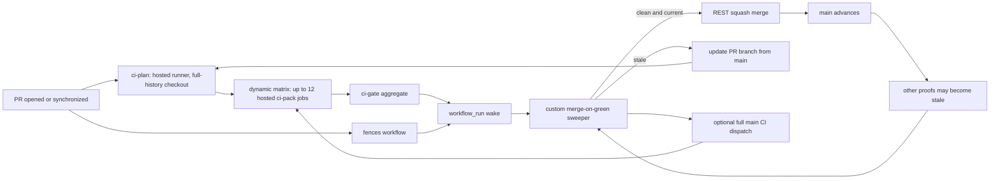
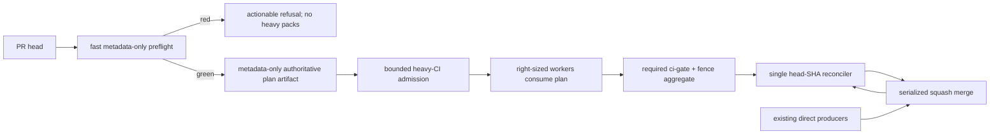

# GitHub CI and merge control-plane incident model — 2026-08-13

**Status:** measured BEFORE record, target architecture, and fresh native-queue
decision. This is not an incident-closure report; remediation criteria remain
unproven unless the acceptance ledger names a live receipt.

## Verdict

The jam is a queue-admission failure amplified by a merge-controller feedback
loop, not an Actions-minutes failure and not one slow test. At the measured peak,
53 non-skipped PR `ci` workflows produced 299 queued or executing runner jobs in
this workflow alone. Most completed workflows used all 12 packs, while hosted
runner acquisition delay was already longer than useful computation. The custom
sweeper then refreshed stale heads, producing more copies of the same expensive
proof.

The custom merge boundary is also unsafe under delayed check publication. PR
#5555 was squash-merged at `2026-08-14T03:53:19Z` even though GitHub did not create
the final head's `ci-plan` job until `03:56:18Z`. The sweeper derived required
anchors from check names visible at that instant, saw completed fences but no CI
anchors, and called that set clean.

GitHub Merge Queue is available to this public organization repository, but a
fresh temporary-branch canary rejected it for `main` under the current direct-push
producer architecture. The queue merged probe PR #5581 quickly once green, then a
single target-branch push destroyed and rebuilt its in-flight merge group. With
323 direct `main` commits in the measured 24-hour window, that invalidation would
recreate the proof treadmill rather than remove it. The temporary ruleset and
branches were cleaned up; current `main` again has no ruleset, classic protection,
or merge queue.

## Capture scope and evidence rules

- Primary run window: PR `ci` workflows created from
  `2026-08-14T02:00:00Z` through `2026-08-14T03:21:59Z`.
- Primary snapshot time: `2026-08-14T04:06:56Z`.
- Population: 73 PR `ci` runs; detailed job/step timing population: the 48 runs
  in that window which had concluded `success` or `failure` at capture.
- Peak-load reconstruction used six stable API pages recaptured after the jam;
  it includes runs created no later than the primary snapshot.
- Native-control configuration receipt: `2026-08-14T04:26:48Z`.
- Workflow-state drift receipt: `2026-08-14T04:35:25Z`.
- All times in this document are UTC.
- A workflow run's immutable `head_sha` is evidence. The PR object's current
  `head.sha` is not: it changes after a branch update.
- A failed head log proves that the head failed. It does not by itself prove
  whether the cause was introduced by the PR, inherited from its frozen base,
  infrastructure, or nondeterminism. That attribution needs a base replay or a
  paired main proof.
- GitHub's run and job APIs expose second-resolution timestamps. Percentiles use
  linear interpolation over observed durations; displayed values are rounded.

The checked-out repository at `2ca4718e92faca8e0af7419f008bc285c6748173`
contains 64,579 tracked files and 188 legacy logical jobs. A local full-plan
validation produced pack weights
`[1036, 556, 555, 555, 555, 555, 555, 555, 556, 556, 555, 555]`;
`engine-render-guards` alone is weight 1036 and `workflow-yaml` is weight 438.
The repository had 88 workflow definitions. A later live inventory showed 87
active and one manually disabled workflow; see “Live configuration drift.”

## Architecture during the incident



The important mechanics are:

1. `.github/workflows/ci.yml` starts for every PR path and keeps per-PR
   `cancel-in-progress` behavior.
2. `ci-plan` checks out full history with `filter: blob:none` and
   `fetch-depth: 0`, materializing the large index before inferring scope. It
   emits a dynamic matrix, changed-file list, and plan hash.
3. Each selected pack performs another checkout, recreates an isolated runner
   environment, and recomputes the plan. `--expect-plan-sha` detects drift, but
   the authoritative plan is not consumed as the execution specification.
4. `ci-pack` has no repository-wide admission bound and no `max-parallel`.
   Per-PR scope can emit from one to all 12 pack jobs.
5. `ci-gate` is a stable aggregate, but no GitHub ruleset or branch protection
   requires it.
6. `.github/workflows/merge-on-green.yml` wakes on completed `ci`, `fences`, and
   `integration-baseline` workflows. Its Python controller lists labeled PRs,
   reads their currently published check runs, compares proof/base surfaces,
   updates stale branches under a lease, and calls the merge API.
7. Main proof is partly maintained by full `workflow_dispatch` CI because
   `ci.yml` has no `push` trigger. That recovery proof is itself a 12-pack load.

## BEFORE measurements

### Outcomes and end-to-end latency

| Measure | Result |
|---|---:|
| PR `ci` runs | 73 |
| Success | 29 |
| Failure | 19 |
| Cancelled | 15 |
| Skipped | 5 |
| Active at capture | 5 (3 queued, 2 in progress) |
| Concluded success/failure timing sample | 48 |
| Workflow end-to-end p50 | 63.09 min |
| Workflow end-to-end p95 | 72.83 min |
| Workflow end-to-end maximum | 91.07 min |

Workflow end-to-end is `run.updated_at - run.created_at` for concluded runs.

### Queue, checkout, planning, and execution

| Stage | n | p50 | p95 | max |
|---|---:|---:|---:|---:|
| `ci-plan` queue | 48 | 1.55 min | 17.11 min | 20.37 min |
| `ci-plan` job execution | 48 | 6.72 min | 8.09 min | 8.35 min |
| `ci-plan` checkout step | 48 | 4.08 min | 4.56 min | 4.83 min |
| `ci-plan` computation step | 48 | 2.53 min | 3.68 min | 3.80 min |
| pack queue | 556 | 13.45 min | 30.62 min | 38.87 min |
| pack job execution | 556 | 23.02 min | 29.88 min | 37.38 min |
| pack checkout step | 556 | 5.45 min | 6.38 min | 9.95 min |
| pack main execution step | 556 | 17.40 min | 24.00 min | 30.62 min |
| `ci-gate` queue | 48 | 3.94 min | 11.43 min | 14.33 min |
| `ci-gate` execution | 48 | 0.05 min | 0.07 min | 0.08 min |

Definitions:

- Job queue is `job.started_at - job.created_at`, using jobs which later
  concluded so `started_at` represents final runner acquisition.
- Job execution is `job.completed_at - job.started_at`.
- Checkout and planner computation are the named step timestamps.
- Pack main execution is `validate and run legacy CI pack`. It includes pack
  plan recomputation, repeated dependency-environment construction, and logical
  test execution; it excludes the outer checkout/setup steps.
- Rows overlap: checkout and computation are components of job execution, not
  additional time.

The planner target of less than 60 seconds after acquisition was missed by an
order of magnitude: p95 planner service was 8.09 minutes. Checkout was the larger
component at p50, but computation alone was also 2.53 minutes p50.

### Pack imbalance and matrix utilization

For 29 successful runs, comparing the fastest and slowest completed packs in
each run:

| Measure | p50 | p95 | max |
|---|---:|---:|---:|
| Pack execution-duration spread | 12.63 min | 18.70 min | 22.40 min |
| Pack runner-acquisition spread | 13.10 min | 22.71 min | 26.97 min |
| Slowest/fastest execution ratio | 1.80x | 2.15x | 2.59x |

Across all 48 detailed runs, 45 emitted all 12 packs, two emitted six packs, and
one emitted four packs. Dynamic matrix support exists, but the fleet-level
selector rarely narrowed enough to use it.

### Representative fanout

Hosted-job count below is `ci-plan + emitted packs + ci-gate`; parallel fences
and unrelated workflows are not counted.

| Shape | Run | Immutable head | Selection | Packs / hosted jobs | End-to-end |
|---|---:|---|---|---:|---:|
| Narrow ordinary change | `31763191017` | `f0a7b5d845c1` | 1 file, 4/188 jobs | 4 / 6 | 51m50s, success |
| Cross-surface product change | `31763116872` | `5466706baa6d` | 7 files, 156/188 jobs | 12 / 14 | 67m25s, failure |
| Broad controller change | `31763212456` | `b458c4f95c76` | 3 files, 146/188 jobs | 12 / 14 | 91m04s, success |
| Global invalidator | `31766586987` | `f48278743fa4` | `.github/ci/legacy-jobs.yml`, 188/188 | 12 / 14 | 40m27s, failure |

The narrow run proves the dynamic matrix mechanism can work. The 45-of-48
full-matrix result proves that it did not control aggregate admission in this jam.

### Run 31763116872 timeline

Run `31763116872` is tied to immutable head
`5466706baa6d68d9dfb7de3c246bf83e95f2a72a`, not the PR's later head.

| Event | Timestamp | Duration / implication |
|---|---|---|
| Workflow created | `02:14:23` | start |
| `ci-plan` runner acquired | `02:31:31` | 17m08s queue |
| planner checkout | `02:31:33`–`02:35:38` | 4m05s |
| plan computation | `02:35:44`–`02:39:20` | 3m36s |
| `ci-plan` completed | `02:39:23` | 7m52s job execution |
| 12 packs created | `02:39:23` | 156/188 logical jobs |
| first pack acquired | `02:45:21` | 5m58s after creation |
| last pack acquired | `02:58:32` | 19m09s after creation |
| first actionable branch failure | `03:09:07` | 54m44s after run start |
| unwired-suite error | `03:20:29` | 66m06s after run start |
| last pack completed | `03:21:36` | slowest evidence settled |
| `ci-gate` | `03:21:43`–`03:21:47` | failed in 4s |
| Workflow completed | `03:21:48` | 67m25s end-to-end |

Within this run, pack queue p50/p95/max was 11m31s/17m26s/19m09s and pack
execution p50/p95/max was 24m22s/30m51s/31m02s. The plan selected all 12 packs
from these seven files:

```text
engine/us_early_turn.py
scripts/build_prophet.py
scripts/export_signal_contracts.py
scripts/grade_us_board.py
site/factordata/contracts/artifact_manifest.json
templates/_prophet_card.html.j2
tests/test_prophet_lifecycle_state.py
```

Two logical jobs failed: `tier-gate` and `workflow-yaml`. The logs include a
receipt-pin assertion for `scripts/build_prophet.py:1899` at `03:09:07`, the
new `tests/test_prophet_lifecycle_state.py` being named by no workflow step at
`03:20:29`, and additional unrelated template/site drift errors immediately
afterward. The handoff's one-failure shorthand is therefore incomplete. The
changed new test and changed Prophet script give direct branch-causality evidence
for the first two findings; the unrelated drift requires a frozen-base replay to
classify as inherited or branch-coupled.

### Simultaneous load

At `2026-08-14T03:45:35Z`, interval reconstruction found:

| Load | Count |
|---|---:|
| Simultaneously active, non-skipped PR `ci` runs | 53 |
| Distinct branches | 44 |
| Associated PR numbers present in run payloads | 42 |
| Pack jobs executing | 177 |
| Pack jobs queued | 109 |
| Planner jobs queued | 2 |
| Gate jobs queued | 11 |
| Total queued/executing runner jobs in `ci` alone | 299 |

At run `31763116872` creation, planner acquisition, and pack creation, the same
interval method found 38, 46, and 40 active PR `ci` runs respectively.

This is sufficient to establish repository-created scheduling pressure. It is
not sufficient to prove the exact Enterprise concurrency ceiling: GitHub does
not expose the account's live hosted-runner cap in the queried APIs, and other
workflows/repositories share it. At `04:35:50Z`, the enhanced billing endpoint
reported 36,591 Actions Linux minutes for `macro` on Aug. 14, gross $219.546 and
net $0 after discounts. Jobs were running and queuing, with no spending-limit
error. The supported inference is scheduler/concurrency pressure, not exhausted
billable minutes.

### Cancellation and failure classification

All 15 cancelled runs had a later run on the same branch with a different head
SHA before the old run finished cancelling. They are therefore classified as
superseded/obsolete, not product reds.

| Cancellation measure | p50 | p95 | max |
|---|---:|---:|---:|
| Old run age when cancellation completed | 7m47s | 69m29s | 70m42s |
| Successor created to old cancellation complete | 3m39s | 16m28s | 20m42s |

Per-PR cancellation is semantically correct but not an instantaneous capacity
release. Obsolete work can remain in the system for minutes after its successor.

Of 19 failed workflows, 18 reached pack execution and emitted product/config
test failures. One, run `31762707978`, was a planner/configuration failure: at
`02:12:13` the planner detected that `house-law-registry` scope omitted two files
its own commands read, widened to a 12-pack full suite without a plan hash, and
every pack later revalidated the same defect and exited 2. The workflow ended at
`02:52:56`, about 40 minutes after the actionable diagnosis.

No runner bootstrap/service failure was identified in the sampled failed logs.
That does **not** establish zero inherited failures or zero flakes: no automated
base counterfactual or controlled rerun classification existed. Current output is
at best `execution test/config`, `planner/config`, or `superseded`; first-class
PR-caused/inherited/infra/flaky classification remains an architecture gap.

### Merge-controller wake storm

From `03:45:49Z` through `03:53:10Z`, 25 `merge-on-green` workflow runs were
created: 10 succeeded and 15 were cancelled. This is controller work, not product
validation, and it was driven by the completion fanout of unrelated workflows.

## PR #5555: an unproven-merge race

Final PR head: `8702857378805902f900c1303fb4cc51301e9664`.
Merge commit: `2ca4718e92faca8e0af7419f008bc285c6748173`.

| Receipt | Time | Meaning |
|---|---|---|
| CI run `31767764521` created | `03:45:35` | Workflow exists, but no planner check yet |
| Fences run `31767764523` completed | `03:52:08` | `fence-pack` succeeded |
| Virtual fence anchors | `03:52:05`–`03:52:06` | `self-mod-fence`, `capability-broker`, `grader-manifest` succeeded |
| Sweeper `31768097165` created | `03:52:11` | success `workflow_run` wake for this head |
| Sweeper reads current proof | `03:53:15` | log: exact checked base still current |
| Sweeper merges #5555 | `03:53:19` | log: “every check concluded clean” |
| Closed-event CI `31768157092` | `03:53:21`–`03:53:22` | planner/pack/gate all skipped; not proof |
| `ci-plan` job in `31767764521` created | `03:56:18` | 2m59s after merge |
| `ci-plan` runner acquired | `03:58:53` | 5m34s after merge |
| `ci-plan` completed success | `04:03:23` | 10m04s after merge; packs only then materialized |

The contemporaneous sweeper log is the decision receipt. A later check-runs API
call shows the jobs after they materialized and must not be projected backward.
At merge time there was no completed `ci-plan`, `ci-pack-*`, or `ci-gate` for the
final head.

The code path explains the result. `proof_anchor_verdict` requires scheduled
pack names only when those check runs are present, and requires `ci-gate` only
when `ci-plan` or `ci-gate` has been published. GitHub had created the workflow
run but not its first job/check. The visible fence anchors therefore formed a
complete-looking set. Absence was interpreted as “not scheduled” instead of
“required status has not arrived.”

This is exactly the boundary native required checks provide: a named required
check that has not reported is pending, not optional. #5555 invalidates any
claim that the custom controller safely waits for all current-head CI evidence.
The later CI result cannot repair the pre-merge proof gap.

## Root causes

| Cause | Evidence | System effect |
|---|---|---|
| No global heavy-CI admission bound | 53 active runs, 299 `ci` jobs at peak | Open PR count converts directly into account pressure |
| Scope is selective only for rare shapes | 45/48 detailed runs used 12 packs; 156/188 and 146/188 examples | “Dynamic” matrix still behaves nearly fixed under realistic cross-surface changes |
| Planner performs repository work before deciding | p95 17.11m queue + 8.09m execution; checkout p95 4.56m | Slow feedback and delayed creation of downstream checks |
| Packs recompute the plan and rebuild many environments | pack main step p50 17.40m | Repeated control work consumes workload capacity |
| Heavy jobs are indivisible and runtime balance is weak | weight 1036 lane; execution spread p50 12.63m | One tail pack determines verdict latency |
| Refresh/re-proof is positive feedback | main movement → stale proof → update branch → new CI; main baseline can add 12 packs | Congestion creates the conditions for more congestion |
| Superseded runs release slowly | cancellation completion lag p95 16m28s | Correct cancellation does not promptly restore capacity |
| Completion fanout is a lossy control signal | 25 sweeps in 7m21s, 15 cancelled | Useful wakeups compete with unrelated events |
| Required evidence is presence-derived | #5555 | Delayed check publication can become merge permission |
| No native enforcement on `main` | no ruleset/protection/queue | Safety depends on one API snapshot and custom code |
| Failure attribution is not machine-readable | 19 reds require log inspection/base reasoning | Late, ambiguous developer feedback and unnecessary refreshes |

## Native GitHub Merge Queue: live capability and blockers

At `2026-08-14T04:26:48Z`:

| Query | Receipt |
|---|---|
| Repository owner/visibility | public repo owned by `mastermindx-market-intelligence` |
| Organization plan | `enterprise` |
| Caller repository permission | `admin: true` |
| Repository rulesets, including parents | `[]` |
| Classic protection on `main` | HTTP 404, “Branch not protected” |
| GraphQL `repository.mergeQueue(branch:"main")` | `null` |
| Repository auto-merge setting | `allow_auto_merge: true` |

GitHub documents merge queues as available to any public repository owned by an
organization, and the REST ruleset schema exposes a repository `merge_queue`
rule. The live capability verdict is therefore **available but unconfigured**.
`allow_auto_merge` is not a queue and provides no missing-check enforcement.

Primary documentation:

- [Managing a merge queue](https://docs.github.com/en/enterprise-cloud@latest/repositories/configuring-branches-and-merges-in-your-repository/configuring-pull-request-merges/managing-a-merge-queue)
- [Troubleshooting required status checks](https://docs.github.com/en/enterprise-cloud@latest/pull-requests/how-tos/merge-and-close-pull-requests/troubleshooting-required-status-checks)
- [Repository rules REST API](https://docs.github.com/en/rest/repos/rules)

### Fresh native-queue experiment and decision

At `2026-08-14T05:52Z–05:59Z`, a scratch `mq-eval-base` ruleset and probe PR
#5581 established the missing live evidence:

1. the repository accepted a merge-queue rule, created merge group commit
   `00951d82`, and refused an ordinary direct squash merge while the queue owned
   the branch;
2. a direct target-branch push (`9065b39c`, carrying `[skip ci]`) destroyed that
   group and rebuilt it as `341d7706`, with state reset to `AWAITING_CHECKS`;
3. the rebuilt group went green and the queue merged #5581 at
   `2026-08-14T05:58:50Z`, 31 seconds after its required proof completed; and
4. adding GitHub Actions App `15368` as a repository-ruleset bypass actor returned
   HTTP 422. More importantly, even a valid dedicated bypass identity would not
   prevent its push from changing the queue base and rebuilding every group.

`git rev-list --count --since='24 hours ago' origin/main` measured 323 direct
commits at the experiment snapshot, roughly one every 4.5 minutes and sometimes
in much tighter bursts. Queue validation longer than that interval would restart
indefinitely. The temporary ruleset and scratch branches were removed after the
receipt; this section records historical experiment evidence, not current live
configuration.

**Decision:** reject native Merge Queue for `main` under the current producer
architecture. Reopen the decision only after direct producers stop advancing
`main`; `merge_group` support remains in code for that future canary. The durable
decision record is
`agentos/decisions/DEC-CI-NATIVE-MERGE-QUEUE-REJECTED.md`.

## Target architecture



The reconciler edge is a target, not current live authority. It remains disabled
until its wake durability, missing-check refusal, and bounded refresh behavior are
proven. Manual merge is the safe interim posture; native and custom controllers
must never overlap.

### Phase A — Stop amplification and add receipts

- Preserve per-head supersession cancellation.
- Stop automatic branch-refresh/backlog re-proof while an admission budget is
  unavailable.
- Publish head/base SHA, scope reasons, selected logical jobs, worker count,
  first actionable failure, and failure class as a machine-readable artifact.
- Exit receipt: backlog growth stops without manual merging or hidden bypass.

### Phase B — Fast preflight and metadata-only planning

- Use PR files API/event data plus sparse repository metadata; do not perform a
  full-depth, full-index checkout before selecting work.
- Extract workflow/manifest validity, unrun-suite closure, conflict markers, and
  plan-schema integrity into a fast preflight. A red preflight must prevent heavy
  fanout.
- Emit one immutable, versioned plan bound to head SHA, tested base/merge-group
  SHA, manifest digest, changed files, selected job specs, dependency hashes, and
  worker allocation. Packs verify and consume it; they do not infer again.
- Exit receipts: preflight p95 under 3 minutes including healthy-load queue;
  planner execution p95 under 60 seconds after acquisition.

### Phase C — Bound heavy work and repair selectivity

- Make worker count a function of selected runtime weight, not merely non-empty
  indices in a fixed 12-way partition.
- Admit authoritative heavy validation only through a bounded lane. Cap per-PR
  parallelism independently from logical coverage, then tune the repository-wide
  budget from throughput and p95 evidence.
- Keep PR-head feedback cheap. Preserve `merge_group` support as a dormant future
  path, but do not depend on it while direct producer pushes invalidate groups.
- Replace unknown ownership with a visible metadata defect. Do not convert an
  unowned narrative file into repository-global proof invalidation.
- Split or narrowly scope indivisible heavyweight jobs and reuse hermetic
  environments by deterministic dependency hash.
- Exit receipt: measured peak remains below the configured heavy-job budget under
  a concurrent-PR burst, with unrelated PRs progressing.

### Phase D — Single-controller recovery and atomic cutover

- Keep the historical custom sweeper disabled while CI authority changes land.
- Preserve an unconditional final-head `ci-gate`, stable fence aggregate, and
  trusted authority boundary; missing or unpublished checks stay pending, never
  optional.
- Replace lossy completion storms with durable head-SHA work and bounded
  reconciliation. A base move may schedule one re-evaluation, not refresh every
  armed branch or duplicate heavy validation.
- Prove red, pending, missing, conflict, stale-base, no-work, and concurrent wake
  behavior before enabling the reconciler.
- Re-enable exactly one controller in an atomic configuration step; native queue
  remains rejected until producers leave `main`.
- Exit receipt: several concurrent eligible PRs merge without babysitting while
  red and incomplete heads remain blocked and main stays green.

### Phase E — Soak and tune

- Measure at least a representative multi-PR burst and ordinary live traffic.
- Tune build concurrency and worker sizing for repository throughput and p95
  merge latency, not isolated-run speed.
- Keep a rollback that restores a safe manual queue, not the unsafe
  presence-derived merge path.

## Acceptance ledger: AFTER proof still required

| Criterion | BEFORE receipt | Required AFTER receipt | State |
|---|---|---|---|
| Incident model | This document and runs above | Representative after run IDs in a closure addendum | BEFORE only |
| Planner service | p95 8.09m after acquisition | p95 <60s across representative live runs | Unproven |
| Fast structural refusal | unwired suite surfaced at +66m06s | deliberate unwired fixture red before packs, p95 <3m | Unproven |
| Narrow fanout | 4/188 exists, but 45/48 used 12 packs | selected jobs explained; ordinary shapes not near-global | Unproven |
| Worker scaling | 4, 6, or 12 packs; overwhelmingly 12 | workers proportional to selected weight | Unproven |
| Obsolete cancellation | successor→old cancel p95 16m28s | no obsolete job starts after successor; bounded release latency | Unproven |
| Global pressure | 299 queued/executing `ci` jobs at peak | burst remains below configured heavy-job budget | Unproven |
| Automated progress | 40+ concurrent armed PR context | several concurrent entries merge without babysitting | Unproven |
| Safe green-to-merge | no valid distribution; #5555 merged before CI | p95 <60s after final required proof when no group validation remains | Unproven |
| Moving-main behavior | update/re-proof feedback loop | unrelated PRs receive zero branch-refresh cycles | Unproven |
| Wake durability | 25 sweeps/7m21s, 15 cancelled | native queue or durable head-keyed wake loses none | Unproven |
| Main safety | custom presence-derived gate disproven | red/pending/missing/conflict cases blocked; main stays green | Unproven |
| Queue drain | jam persisted | queue drains by automation without manual merges | Unproven |
| Native queue decision | capable, not configured | adopted with receipts, or rejected by a fresh canary/API blocker | **Proven rejected for current producer architecture**: #5581 + direct-push group rebuild + bypass 422 |

No p50/p95 green-to-merge value is reported for the primary window: successful
heads were subsequently advanced/refreshed or remained unmerged, so pairing their
old run completion with a later PR merge would be false evidence. #5555 is a
safety counterexample, not a green-to-merge observation.

## Live configuration drift

At `2026-08-14T04:35:25Z`, after the incident window and after the primary
measurement snapshot, the workflow inventory returned 88 definitions, 87 active,
and `.github/workflows/merge-on-green.yml` (`id: 322071347`) as
`disabled_manually`. That is an in-progress configuration change. It is not proof
that the queue drains, that another controller is authoritative, or that any
performance/safety acceptance metric has passed.

## Concise reproduction commands

All commands are read-only. Quote API paths containing `?` under zsh.

```bash
GH=/opt/homebrew/bin/gh
REPO=mastermindx-market-intelligence/macro
CI_WORKFLOW=297914825

# Run window (repeat pages until the window is covered).
for page in {1..6}; do
  "$GH" api "repos/$REPO/actions/workflows/$CI_WORKFLOW/runs?event=pull_request&per_page=100&page=$page"
done | jq -s '[.[].workflow_runs[]]'

# Job/step timestamps for one run.
"$GH" api "repos/$REPO/actions/runs/31763116872/jobs?per_page=100"
"$GH" run view 31763116872 --repo "$REPO" --log-failed

# Exact #5555 receipts.
"$GH" api "repos/$REPO/pulls/5555"
"$GH" api "repos/$REPO/commits/8702857378805902f900c1303fb4cc51301e9664/check-runs?per_page=100"
"$GH" api "repos/$REPO/actions/runs/31767764521/jobs?per_page=100"
"$GH" run view 31768097165 --repo "$REPO" --log

# Native-control configuration.
"$GH" api "repos/$REPO/rulesets?per_page=100"
"$GH" api "repos/$REPO/branches/main/protection"
"$GH" api graphql -f query='query {
  repository(owner:"mastermindx-market-intelligence", name:"macro") {
    mergeQueue(branch:"main") { url }
  }
}'
"$GH" api orgs/mastermindx-market-intelligence --jq '{login,plan:.plan.name}'
"$GH" api "repos/$REPO/actions/workflows?per_page=100"

# Billing receipt; usage accumulates during the UTC day.
"$GH" api 'organizations/312036563/settings/billing/usage?year=2026&month=8&product=actions'
```

For the timing tables, compute durations from the definitions in “Queue,
checkout, planning, and execution,” filter to the stated 48-run population, sort
each duration vector, and apply linear-interpolated p50/p95. For simultaneous
load, a run/job is active at time `t` when `created_at <= t < completed_at` (or
`updated_at` for a workflow); it is queued when `t < started_at` and executing
when `started_at <= t < completed_at`.
