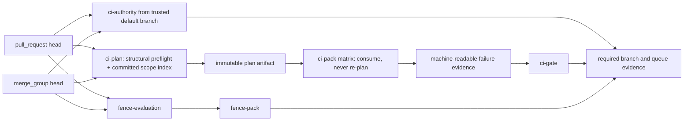

# CI and merge control plane

This document is the operating map for Macro's pull-request validation and merge
authority. It deliberately separates repository code from live GitHub
configuration: a workflow committed to `main` is not a required check, ruleset,
merge queue, or live proof until GitHub configuration and run receipts establish
that state.

## Repository validation contract

`ci-authority` is the trusted-code boundary. Its `pull_request_target` job checks
out only the default branch, treats the candidate head and file list as API data,
and re-reads exact PR identity after file pagination. Ordinary candidate changes
pass. Changes to CI authority surfaces require a same-repository PR whose author
and current event actor both have live `admin` permission. Base-specific
`ci-authority/main` and `ci-authority/codex/merge-queue-pilot` checks invalidate
one another so a base retarget cannot reuse a verdict. The stable job supplied by
an organization required-workflow ruleset remains the primary authority; custom
check runs are complementary evidence, never a replacement for that rule.

`ci-plan` checks out the exact event SHA with a sparse metadata worktree. It:

1. consumes the exact base-to-head path set;
2. runs structural preflight before heavy packs;
3. verifies `.github/ci/scope-index.json` against exact Git tree identity;
4. selects logical jobs and a weight-based worker count once; and
5. publishes one digest-bound `ci.pack_plan.v2` artifact.

The committed scope index binds the legacy manifest, selector sources, ordered
job inventory, inferred paths, Python dependency-structure signatures, and
presence of statically discovered non-Python path candidates. Git paths are
literal and case-sensitive. Non-regular entries, unreadable objects, dependency
topology drift, unknown executable roots, unknown non-passive ownership, unwired
tests, malformed workflows, and manifest admission defects fail before packs.

Each `ci-pack` downloads and consumes the planner artifact. It verifies the
external plan digest, head/base SHA, selector and manifest digests, exact-once job
inventory, assignment, weight, and matrix index before executing. Consume mode
does not call diff discovery, scope inference, or partitioning. If the planner
explicitly widens after a safe inference failure, the compatibility path runs the
full suite rather than accepting partial proof.

Admission is bounded independently from logical coverage:

- pull requests: at most 2 hosted packs running per PR;
- merge groups: at most 4 packs, while queue build concurrency serializes groups;
- trusted `workflow_dispatch` on `main`: up to 12 packs, globally deduplicated.

The engine render-guard singleton is split into five schedulable jobs. The full
192-job manifest currently partitions into 12 predicted packs of weight
approximately 607–610 instead of one pack being pinned by the former 1036-weight
singleton.

`ci-gate` always runs for non-closed events. It fails unless planning succeeded,
the selected matrix succeeded when work exists, the evidence collector completed,
and the emitted failure-summary status is `clear`. Missing pack records become
`startup_failure` infrastructure evidence and cannot be converted into a green
gate. A proven no-work plan still emits an affirmative green `ci-gate`.

Every terminal pack produces compact evidence. The aggregate classifies planner
configuration, candidate/inherited logical failure when supported by explicit
replay evidence, infrastructure, flaky/nondeterministic, unknown, or superseded
cancellation. A separate read-only `workflow_run` completion lane classifies
cancelled runs that cannot reliably execute same-run finalizers.

`fence-evaluation` runs candidate-facing checks with read-only permission.
`fence-pack` is a separate no-checkout aggregate with no permissions and trusts
only the native result of `fence-evaluation`; candidate test code cannot alter the
required aggregate in a later step of the same job.

## Merge authority and live state

At the incident cutover, the custom `merge-on-green` workflow is manually
disabled. Keep it disabled: its historical presence-derived proof set allowed PR
#5555 to merge before the final-head CI job existed. The controller code may
remain temporarily for rollback archaeology, but it is not merge authority and
must not compete with a native queue.

Native Merge Queue is supported by the current public organization-owned
Enterprise repository. Code now handles `merge_group`; live adoption still
requires configuration receipts. Use the fixed
`codex/merge-queue-pilot` branch first:

1. install the organization required-workflow rule for `ci-authority.yml` on the
   pilot in evaluation mode, then active mode after a fresh PR proves it;
2. require the pilot-specific authority context, `ci-gate`, and `fence-pack` from
   the expected GitHub Actions App;
3. enable a one-build, one-entry `ALLGREEN` merge queue on the pilot;
4. prove red, pending, missing, conflict, base-retarget, merge-group, and no-work
   behavior plus several automatic merges; and
5. verify the resulting branch and workflow audit receipts before considering
   `main`.

The temporary producer-bypass canary uses `repository_dispatch`, so GitHub runs
the workflow definition from the default branch. It accepts one named operator
and hard-codes both checkout and push destination to the pilot. Any ruleset bypass
for GitHub Actions App ID `15368` authorizes the whole App, not one workflow. It is
therefore transitional and pilot-only. Do not grant that App a `main` bypass until
all write-capable workflow entry points have been audited or producers use a
dedicated identity/PR path.

The pilot is not proof of `main` adoption. Main cutover requires an atomic order:

1. successful pilot acceptance receipts;
2. required trusted workflow and stable aggregate rules installed for `main`;
3. native queue active for `main`;
4. custom merger still disabled; and
5. direct-push authority explicitly narrowed or removed.

Rollback disables the new repository queue rule before the organization workflow
rule, preserves unrelated rulesets, leaves the unsafe custom merger disabled, and
returns to a safe manual merge posture while evidence is repaired.

## Known limits and proof ledger

Scope explanations are deterministic, but ordinary engine/scripts/site changes
still select more than 100 logical jobs because shared dynamic imports, repository
traversals, Git metadata, and caller-owned path parameters remain genuinely broad
or opaque. Do not narrow those edges by guesswork. Prefix ownership and finite
dynamic-target contracts need a separate measured phase before selectivity can be
called complete.

Repository tests prove contracts, not live throughput. The following remain live
acceptance evidence, recorded in the incident closure report rather than inferred
from local green tests:

- post-acquisition planner p50/p95;
- fast-preflight latency on a deliberately unwired suite;
- selected jobs and workers for representative narrow PRs;
- peak heavy-job load during a concurrent burst;
- supersession cancellation behavior;
- automatic multi-PR queue progress and drain;
- green-to-merge latency;
- moving-main behavior; and
- main health after automated merges.

See `docs/ci-control-plane-incident-2026-08-13.md` for the measured BEFORE model,
run IDs, timing definitions, the #5555 safety counterexample, and the AFTER ledger.
