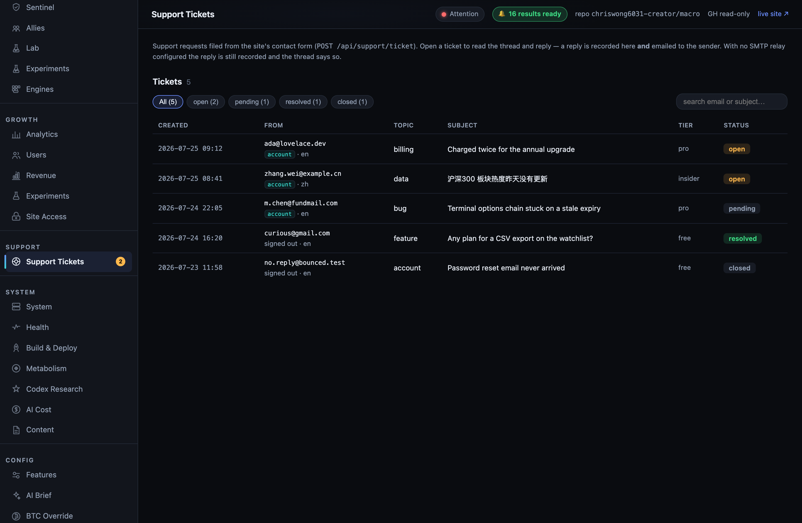
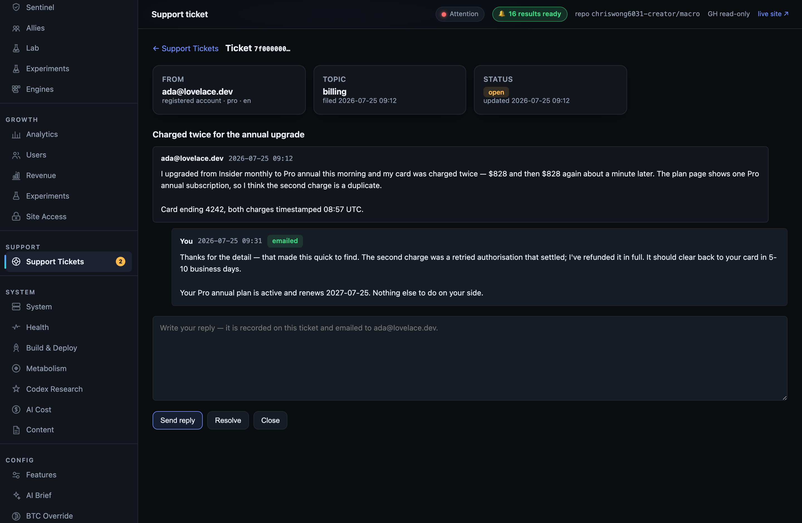
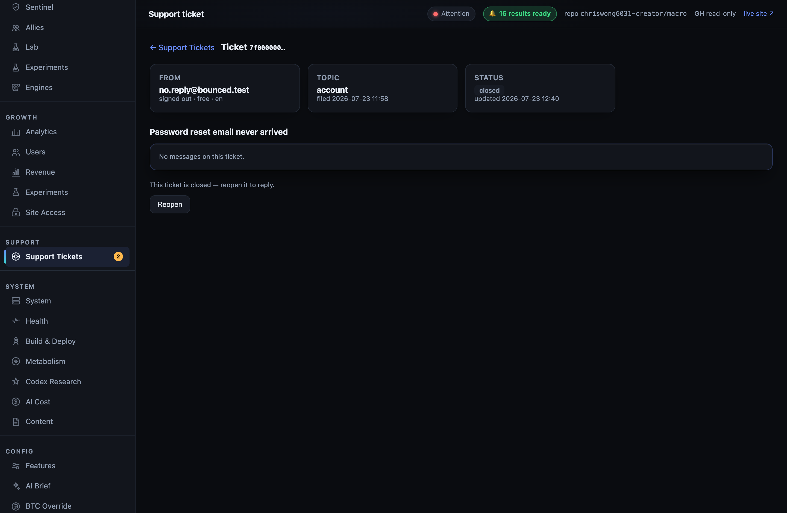

# Support + email estate — operator setup (SEE W1)

The **code** ships in this repo and works today in **mail-off mode** — tickets file, threads
record, the operator console answers; nothing leaves the building until the relay below exists.

| Piece | Where |
|---|---|
| Schema (6 tables, deny-all RLS) | `scripts/deploy/0007_support_email.sql` |
| Mail transport + send ledger | `app/mailer.py` |
| Public ticket intake | `app/support.py` → `POST /api/support/ticket` (mounted in `app/main.py`) |
| Operator console | `admin/support_tickets.py` + admin console → **Support → Support Tickets** |
| Secret delivery | `.github/workflows/deploy-api-secrets.yml` |
| Tests | `tests/test_mailer.py`, `tests/test_support_api.py`, `tests/test_admin_support_tickets.py` (CI job `support-email-spine`) |

Everything below is **operator ops** — one-time actions outside the repo.

---

## 1. Provider SMTP credentials + DNS

Pick a transactional relay (Resend, Postmark, SES, Mailgun — any authenticated SMTP submission
endpoint works; `app/mailer.py` is stdlib `smtplib`, no vendor SDK). Create a sending domain for
`mastermind-x.com`, then add the records the provider gives you.

**⚠️ ADD these records. Never REPLACE the existing `MX`.** The domain already receives mail
(see the `mastermind-x` DNS/mail notes); a sending provider only needs SPF/DKIM/DMARC, and
overwriting the MX would silently black-hole every inbound message including the support
replies users send back.

| Record | Type | Value | Note |
|---|---|---|---|
| `mastermind-x.com` | TXT (SPF) | merge the provider's `include:` into the **existing** SPF record | one SPF TXT per domain — merge, never add a second |
| `<selector>._domainkey.mastermind-x.com` | TXT/CNAME | as issued by the provider | DKIM |
| `_dmarc.mastermind-x.com` | TXT | `v=DMARC1; p=none; rua=mailto:dmarc@mastermind-x.com` | start at `p=none`, tighten to `quarantine` after a week of clean reports |

Verify in the provider's dashboard before step 2 — an unverified domain sends, but lands in spam.

## 2. Deliver the secrets to the droplet

Add these as **GitHub repository secrets**, then run the **deploy-api-secrets** workflow
(Actions → *deploy-api-secrets* → *Run workflow*). It writes them to `/etc/macro-api.env`
**and** `/etc/macro-admin.env` and restarts both services. Absent secrets are simply omitted —
that is mail-off mode, not an error.

| Secret | Required | Meaning |
|---|---|---|
| `MAIL_SMTP_HOST` | yes | relay hostname |
| `MAIL_SMTP_PORT` | no | defaults to `587` (STARTTLS). `465` selects implicit TLS |
| `MAIL_SMTP_USER` | yes | relay username / API key id |
| `MAIL_SMTP_PASS` | yes | relay password / API key |
| `MAIL_FROM` | yes | envelope + header From, e.g. `hello@mastermind-x.com` |
| `MAIL_REPLY_TO` | no | where user replies land, e.g. `support@mastermind-x.com` |
| `MAIL_SUPPORT_TO` | no | where NEW-ticket alerts go. Unset → no operator alert (tickets still file) |
| `MAIL_UNSUB_SECRET` | no | HMAC key for one-click unsubscribe tokens. **Also keys the ticket IP hash** — set it: without it the stored `meta.ip_hash` is a bare SHA-256 of an IPv4, which is a 2^32 brute force, i.e. not anonymisation |

Prefer a **bare address** for `MAIL_FROM` / `MAIL_REPLY_TO`. A display-name form
(`Mastermind <hello@…>`) is delivered intact — the workflow's `_addv` helper preserves inner
spaces where the older `_add` would strip them — but a bare address has no quoting edge cases in
a systemd `EnvironmentFile`.

`is_configured()` requires **host + user + pass + from**. A partial config counts as mail-off on
purpose: half a relay produces a slow timeout on every request, which is worse than an honest skip.

Both services need these because there are two senders: **macro-api** sends the operator's
new-ticket alert, and the **admin** console sends ticket replies.

Manual equivalent, if you would rather not use the workflow:

```bash
# on the droplet, then: systemctl restart macro-api admin
printf 'MAIL_SMTP_HOST=...\nMAIL_SMTP_USER=...\nMAIL_SMTP_PASS=...\nMAIL_FROM=hello@mastermind-x.com\n' \
  >> /etc/macro-api.env
```

## 3. Apply the migration

Supabase dashboard → **SQL editor** → paste and run `scripts/deploy/0007_support_email.sql`
(the 0005/0006 precedent — there is no migration runner on the render path). Idempotent, safe to
re-run. It creates `support_tickets`, `support_ticket_messages`, `email_log`, `email_prefs`,
`email_suppression`, `email_campaigns`, their indexes, and **deny-all RLS on all six** — no client
policy exists, so the browser can neither read nor write. Every reader/writer is server-side:

* `app/support.py` and `app/mailer.py` — service-role PostgREST (`SUPABASE_SERVICE_ROLE_KEY`,
  already present in `/etc/macro-api.env` for analytics/brain).
* `admin/support_tickets.py` — Supabase **Management-API SQL** with the `SUPABASE_ACCESS_TOKEN`
  PAT the admin already holds. **No new admin secret is needed.**

One consequence worth knowing: the admin process has the PAT but usually not the service-role key,
so when it mails a reply, `app/mailer.py` cannot write its `email_log` row. It logs
`ledger unavailable … sending WITHOUT idempotency` and sends anyway — deliberate, because a lost
support reply is a real product failure and a rare duplicate is an annoyance. Add
`SUPABASE_SERVICE_ROLE_KEY` to `/etc/macro-admin.env` if you want the operator replies ledgered too.

## 4. Mail-off mode (what "not configured yet" looks like)

With no relay credentials the whole estate still works:

| Surface | Behaviour |
|---|---|
| `POST /api/support/ticket` | 200, ticket + first message written, `ok:true` with a `ticket_id` |
| Operator alert | `email_log` row with `status='skipped_no_smtp'`; no send attempted |
| Console reply | message appended, thread shows a **"not emailed"** pill, toast says so |
| `send()` return | `'skipped_no_smtp'` — never an exception, never a 500 at a caller |

Nothing is silently dropped: every attempt lands a ledger row, and the thread tells the truth about
what left the building.

## 5. Keep Stripe's own customer emails OFF (SEE-R8)

Stripe Dashboard → **Settings → Customer emails** → leave *Successful payments* and *Refunds*
**disabled**, and **Settings → Billing → Subscriptions and emails** → leave the dunning/renewal
reminders **disabled**.

We send our own receipts and dunning notices from this estate. Turning Stripe's on produces two
emails per event with different branding, different language (Stripe's are English-only — half our
audience reads 中文), and no `email_log` row, so the ledger stops being the record of what a user
received.

## 6. Verify

1. `curl -sS -X POST https://mastermind-x.com/api/support/ticket -H 'content-type: application/json' -d '{"email":"you@example.com","topic":"other","subject":"relay smoke test","message":"checking the support spine end to end"}'`
   → `{"ok":true,"ticket_id":"…"}`
2. Admin console → **Support → Support Tickets** → the ticket is listed, `open`, with a nav dot.
3. Open it, send a reply → the thread shows an **emailed** pill and the message arrives.
4. Supabase → `select status, count(*) from email_log group by 1;` → `sent`, not `failed`.

If step 3 shows **not emailed**, read `journalctl -u admin -n 50 | grep mailer` — the status
(`skipped_no_smtp`, `failed`) and the exception **class** are logged. Bodies and credentials never
are, by design.

---

## Appendix — what the operator console looks like

Captured against the real `admin` server with fixture rows (only the Management-API SQL seam
`admin.users._query` was stubbed; routes, `app.js`, and `styles.css` are production code).

**List** — status chips with live counts, search, and the tier/lang/topic snapshot columns.
The **Support** nav group sits between Growth and System, with an open-ticket count dot.



**Thread** — user and operator messages offset from each other, the `emailed` pill, the reply
composer, and only the actions that are legal for an `open` ticket.



**Closed ticket** — no composer at all, a plain-word explanation, and only `Reopen`.


