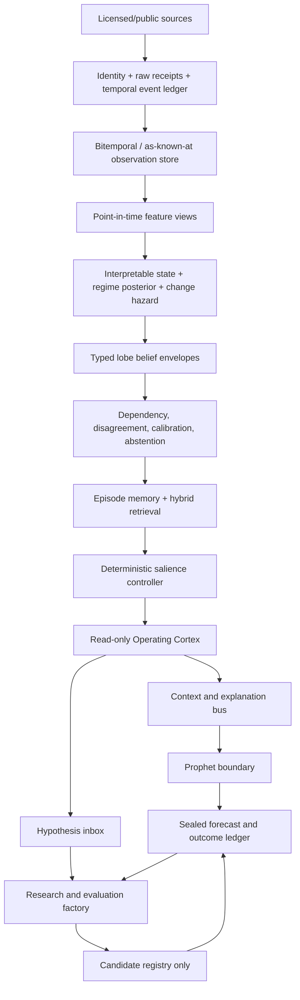

# Konseki clean-room assessment, Market Memory W0, and the Mastermind cognitive architecture

Date: 2026-08-08
Audience: Chris, Fable, Neural Web, Prophet, data-platform, and options-program owners
Status: **W0 implemented; PIT Historical Experience Simulator not yet implemented**
Authority: research/product architecture. Nothing in this document grants signal, ranking, sizing, gating, Prophet, portfolio, or execution authority.

---

## Executive ruling

**Study Konseki's product compression; do not copy or depend on its engine.**

Konseki turns a familiar historical-analogue workflow into an unusually clear retail product: enter a symbol, see comparable paths, inspect forward distributions and path risk, and read a short qualified summary. That interaction is worth learning from.

The strategic capability belongs inside Mastermind, but Konseki should not become its foundation:

1. Konseki's current [Terms](https://konseki.io/terms) explicitly prohibit using the service to build a competing historical-context product and prohibit reverse engineering or replicating its methodology. Multiple free accounts to evade quotas would cross the same boundary. We will not do that.
2. Public documentation does not establish a production-quality point-in-time universe, corporate-action policy, delisting treatment, overlap embargo, independent effective sample size, source licence, revision model, or out-of-sample calibration.
3. Mastermind already owns independent analogue and episode engines that predate this assessment. Building another matcher would duplicate them and violate the repository's reuse discipline.
4. Konseki covers a narrow price/volume similarity problem. Mastermind's opportunity is much larger: macro, curve, credit, breadth, volatility/options, positioning, dark pool, intraday structure, fundamentals, earnings, news, alternative data, and existing Prophet context under one temporal evidence contract.

The correct decision is:

| Decision | Ruling |
|---|---|
| Use the $12 plan for personal evaluation | **Yes, optionally**, for a bounded benchmark after confirming current entitlement |
| Use multiple accounts to expand calls | **No** |
| Embed Konseki output into Neural Web or Prophet now | **No** |
| Seek a written enterprise/custom licence | **Optional**, only if vendor output remains useful after independent validation |
| Build Mastermind's strategic market-memory capability | **Yes**, independently and clean-room |
| Copy the product's simplicity | **Yes, at the category/workflow level** |
| Copy formulas, weights, tags, JSON, prose, design, or corpus | **No** |
| Give analogue output Prophet authority | **No; context/shadow only until feature-level promotion** |

The original ChatGPT proposal in `Mastermind_Cognitive_Architecture_Original_Response.md` has the right strategic shape—deterministic lobes, persistent state, memory, attention, an operating Cortex, a research Cortex, outcome evaluation—but the wrong build order. The upgrade is:

> temporal evidence spine → sealed forecasts/outcomes → interpretable state → honest replay → episodic retrieval → read-only Cortex → governed research factory → narrowly promoted deterministic features

not:

> giant vector → LLM “lives through history” → self-adjusting superintelligence

The most important substrate is **temporal memory before cognitive memory**.

---

## 1. Evidence boundary and clean-room record

### 1.1 What was inspected

Research used only public pages, public HTTP behavior, public search-index history, the vendor's public GitHub/npm MCP wrapper, primary research, the supplied ChatGPT Markdown, and the current Mastermind repository.

No Konseki login, private route, API key, quota circumvention, bulk extraction, proprietary output corpus, or private implementation was used.

### 1.2 Claim labels

- **Verified:** directly observed public behavior or current repository code.
- **Vendor claim:** a statement made by Konseki that was not independently validated.
- **Inference:** a reasoned architectural/product conclusion.
- **Recommendation:** the proposed Mastermind direction.

### 1.3 Safe boundary

Safe:

- learn from the category, workflow, progressive disclosure, and evidence-first positioning;
- independently implement public/common time-series and retrieval methods over licensed data;
- design distinct formulas, labels, schemas, UI, prose, thresholds, and validation;
- retain a source log and code-history proof of independent development;
- use Konseki only under a written licence if vendor data ever enters a Mastermind product.

Not safe:

- reproduce Konseki's weights, thresholds, tags, response schema, copy, screenshots, or curated examples;
- query authenticated output to infer its engine or train a parity model;
- use many accounts or keys to reconstruct its corpus;
- proxy or rehost its raw output;
- treat it as a calibration oracle for a competing engine.

This is a product/engineering risk assessment, not legal advice.

---

## 2. Konseki product audit

### 2.1 Current product, as publicly served on 2026-08-08

The [homepage](https://konseki.io/) leads with one job: “see what happened last time” before taking a trade. Its fixed AAPL example compresses the product into one screen: current path, a subset of matching periods, sample count, positive share, median outcome, distribution, risk/reliability tags, and a qualified takeaway.

The authenticated Explore route is magic-link gated. Public pages imply the following flow:

1. enter an email;
2. use a one-time login link;
3. search a ticker;
4. select a lookback;
5. inspect matches, forward distributions, path risk, and commentary;
6. access an API key on an eligible plan.

The public methodology describes:

- eight lookbacks: 5, 10, 15, 20, 25, 30, 40, and 50 trading days;
- four forward windows: 3, 5, 10, and 15 trading days;
- cross-symbol historical matches;
- component distances for normalized correlation, path shape, realized volatility, trend, range position, volume, and downside/risk behavior;
- 1–5 match-quality dimensions;
- positive rate, mean, median, min/max, and return percentiles;
- maximum adverse/favorable excursion;
- time/symbol diversity and same-calendar-month comparisons;
- categorical direction, consistency, reliability, risk, and outlier tags;
- dated precomputed artifacts and historical lookup on eligible plans.

Sources: [engine description](https://konseki.io/methodology/how-the-engine-computes-historical-context), [similarity components](https://konseki.io/methodology/seven-components-match-similarity-scoring), and [API documentation](https://konseki.io/docs).

The official [Konseki MCP repository](https://github.com/konseki-official/konseki-mcp) is a thin MIT-licensed public-API client. It is not the analytical engine.

### 2.2 Pricing is in transition

Current public [pricing](https://konseki.io/pricing):

| Plan | Current public offer |
|---|---|
| Free | $0; 200 **symbol analyses** per month; 15-day lookback; four forward windows; no API |
| Pro | $12/month; all eight lookbacks; “unlimited” ordinary-use analyses; API |
| Custom | negotiated universe, historical snapshots, and support |

Older search-indexed pages recently advertised API-first Free/Lite/Pro/Research plans at $0/$19/$49/custom with 200/5,000/20,000 API calls. Those pages are retired or 404. The user's “200 free API calls” understanding therefore appears to describe the earlier offer, not the current public plan. An existing account may be grandfathered; only an authenticated entitlement check can confirm it.

### 2.3 What is genuinely strong

- **Product compression:** one question, one input, one coherent answer.
- **Progressive disclosure:** the example is understandable before methodology is opened.
- **Distribution before verdict:** median, tails, MAE/MFE, and count are more honest than a single score.
- **Machine/human parity:** structured fields can support tools while commentary serves retail users.
- **Low evaluation friction:** $12 is a cheap sandbox.
- **Batch artifacts:** precomputation and dated outputs are directionally correct for reproducibility.
- **Qualified positioning:** public copy repeatedly calls the product historical context, not prediction.

### 2.4 What is not publicly established

- market-data vendor and redistribution rights;
- exact live universe and historical point-in-time membership;
- inactive/delisted securities and delisting returns;
- symbol changes, mergers, IPO age, and corporate actions;
- split/dividend adjustment policy;
- exact formula, weights, thresholds, and candidate selection;
- overlapping-match exclusion, label overlap, embargo, or effective independent sample count;
- currency/calendar/limit-move/liquidity normalization across countries;
- bad tick, missing volume, stale price, and revision policies;
- confidence intervals, block bootstrap, null comparisons, or calibration;
- independent out-of-sample or live-forward results;
- engine, universe, source-vintage, and code version on historical artifacts;
- SLA, security controls, recovery, and enterprise key governance.

An immutable file generated today for a 2014 date is a **recomputed historical artifact**, not proof of what an engine emitted or knew in 2014. Those must be separate product claims.

### 2.5 Moat assessment

The exposed JSON, MCP wrapper, and seven component names are not a durable moat. The defensible work would be:

1. licensed point-in-time market data and universe history;
2. a long, genuinely versioned artifact corpus;
3. calibrated match selection and uncertainty;
4. corporate-action, delisting, revision, and evidence QA;
5. product compression and distribution.

Konseki publicly proves the fifth and plausibly implements parts of the second/third. It does not publicly prove the first four at production-research quality.

### 2.6 GTM lessons for Mastermind

Adopt:

- one memorable question at the top of the page;
- a real example visible before methodology;
- symbol search with near-zero setup;
- forward distributions and path risk, not an “AI score”;
- sample size and evidence caveats beside the result;
- a low-friction product surface usable without learning Neural Web internals;
- methodology/content pages that make the workflow discoverable;
- API/tool access as a product extension, not the core moat.

Do not mirror $12 as a standalone price reflexively. Market Memory is more valuable as a visible reason to retain/upgrade the existing Mastermind suite. A public fixed example or bounded teaser can acquire users; full macro + symbol + PIT replay belongs in a paid tier. Pricing should follow measured conversion/retention, not competitor anchoring.

---

## 3. What Mastermind already owns

The most important repository conclusion is **extend, do not rebuild**.

### 3.1 Macro analogues already exist

`engine/neuralweb/brain_analogues.py` already implements `brain.analogues.v1`:

- current complete macro query state;
- growth, inflation, 2s10s, 10y3m, VIX, breadth;
- quad, liquidity, and cycle categories;
- temporal exclusion around the query;
- episode diversity spacing;
- bounded deterministic retrieval;
- S&P 500 5/20/60-session paths, 10-year yield change, and VIX change;
- display-only language and tests against leakage/probability claims;
- an existing Brain tool, `get_historical_analogues`.

This is the current macro-memory lobe. W0 productizes it; it does not replace it.

### 3.2 The per-symbol historical playbook already exists

`engine/stock_events.py` and `engine/event_atlas.py` implement the Signal Episode Atlas:

- one frozen RSI-MACD event taxonomy across 2-session, 3-session, and weekly grids;
- strictly trailing event classes;
- matured-only 21/63-session and 13/26-week outcomes;
- absolute and SPY-excess outcomes;
- pre/post-2010 split;
- name, sector, archetype, and global support counts;
- hierarchical empirical-Bayes shrinkage (name → archetype → global);
- explicit survivor-bias, clustering, era, and authority caveats;
- display-only authority;
- current per-ticker receipts already rendered on stock pages.

`engine/prophet_doors.py` already allows a tightly controlled Door W read of the same receipt after selection, with zero selection authority. This is the correct precedent: the context can explain/measure a candidate without becoming the candidate selector.

### 3.3 Other relevant memory systems

- `scripts/build_analog_library.py` and `data/cycle_pattern/analog_library.parquet`: cycle-pattern analogue library.
- `scripts/build_china_analogs.py`: China analogue display layer.
- `engine/oracle/episodes.py`: Oracle episodic memory.
- `engine/provisional_replay.py` and `engine/rule_replay.py`: bounded replay precedents.
- `engine/neuralweb/world_state.py`: read-only composition of domain-owned artifacts.
- `engine/neuralweb/envelope.py`: source schema/producer/time/hash/tier envelope.
- `engine/neuralweb/constitution.py`: A0–A7 authority ladder and permanent A7 origination ban.
- `docs/SIGNAL_BUS.md` and `config/synapse.yml`: canonical artifact/consumer registry.
- `research/DO_NOT_REBUILD.md`: binding collision/kill registry.

### 3.4 The learned all-lobe embedding is correctly parked

`research/neuralweb/latent_state/feature_coverage.md` and `panel_manifest.json` audit 65 candidates (64 usable after excluding the forward label):

- 13 `pit_live`;
- 22 `recomputed_history`;
- 29 `current_snapshot_backfill`;
- **0 rolling-vintage**.

Most options, kernel, confluence, and personality families begin after 2021 or in 2026. A unified embedding trained now would learn data availability/era as much as market state. `research/NW_CORE_COGNITION_ADJUDICATION_BY_FABLE.md` therefore parks the encoder until its come-back gate. This program does not reopen that ruling.

---

## 4. W0 implementation in this change

### 4.1 What is implemented

| Capability | State | Owner |
|---|---|---|
| One Market Memory product page | Implemented | `templates/market_memory.html.j2`, `site/market_memory.{html,css,js}` |
| Paid/current-context API | Implemented | `app/market_memory.py` |
| Macro-state memory adapter | Implemented by reuse | `engine/neuralweb/market_memory.py` → `brain_analogues.py` |
| Symbol episode-memory adapter | Implemented by reuse | `engine/neuralweb/market_memory.py` → `event_atlas.py` |
| Explicit all-false authority | Implemented | `engine/neuralweb/market_memory.py` |
| Canonical `as_known_at` contract | Implemented and tested | `engine/neuralweb/market_memory.py` |
| Mandatory domain coverage, including options | Implemented in contract | `CANONICAL_CONTEXT_DOMAINS` |
| Future-EOD/OI clock rejection | Implemented in contract tests | `tests/test_market_memory.py` |
| Current navigation/build integration | Implemented | `_navlinks`, `nav_market.js`, `build_site.py` |

The page exposes two live lenses:

1. **Whole-market memory:** current macro state plus dated macro episodes and observed forward paths.
2. **Symbol episode memory:** current event class on W/2B/3B grids, shrunken historical outcome receipts, support counts, and era notes.

### 4.2 What W0 does not implement

| Capability | State |
|---|---|
| Requested-date `/as-known-at` query API | Not implemented |
| Immutable operational state snapshots | Not implemented |
| Frozen historical membership/security identity | Not implemented |
| Rolling-vintage macro feature store | Not implemented |
| Options chain/surface/OI point-in-time snapshots | Not implemented |
| Dark-pool/intraday/news/fundamental/earnings PIT playback | Not implemented |
| Effective independent match count or block-bootstrap bands | Not implemented |
| Historical Cortex forecast simulation | Not implemented |
| Prophet training/influence | Deliberately blocked |

Therefore W0 is a **current-context product/composition shell over real existing engines plus a frozen PIT contract**. It is not the complete Historical Experience Simulator and must never be described as one.

The symbol engine currently discloses `current membership (survivor-biased backfill)`. The API carries `historical_basis=recomputed_history`; the UI prints that limitation. Current recomputation is not historical truth.

---

## 5. Canonical `as_known_at` contract

The contract lives in `engine/neuralweb/market_memory.py` as `market_memory.as_known_at.v1`.

Its purpose is to stop the options program—or any other learner—from creating a second market-history/state engine.

### 5.1 Required clocks

- `event_time`: time in the modeled market/world.
- `measurement_end`: end of the source measurement window.
- `available_at`: when the source/vendor made that measurement available.
- `observed_at`: when Mastermind captured or produced the receipt.
- `as_known_at`: the product/query name for the decision-time cutoff;
- `knowledge_cutoff`: the byte-identical repository-contract alias for `as_known_at`.

Operational PIT law:

```text
event_time <= measurement_end <= available_at <= observed_at <= as_known_at
```

Public reconstruction law:

```text
event_time <= measurement_end <= available_at <= as_known_at
observed_at may be later, but remains visible and the mode is public_reconstruction
```

This distinction prevents a backfilled public series from being misrepresented as something Mastermind operationally possessed.

`operational_pit` accepts only `live_captured` or `source_vintage` evidence observed by the cutoff; an explicitly missing feature may use `unknown`. Recomputed history, public reconstruction, current-snapshot backfill, and unknown observed values fail closed in operational mode.

### 5.2 Required source receipt

Each source includes:

- stable `receipt_id` and `source_id`;
- all clocks above;
- `vintage_id` and `revision_id`;
- `pit_basis`;
- `availability_class`;
- `market_session`;
- quality status, flags, observation-time staleness, and imputation;
- deterministic `age_at_cutoff_seconds` in the context projection.

`receipt_id` hashes the immutable source evidence, including its clocks,
artifact, vintage, revision, and observation-time quality. It deliberately does
not hash `age_at_cutoff_seconds`: replaying the same receipt at a later valid
cutoff changes the context ID and age projection, not the durable receipt ID.

Allowed availability classes explicitly include `intraday`, `session_close`, `eod_vendor_snapshot`, `open_interest_eod`, scheduled releases, filings, news, revisions, and reconstructed snapshots.

Open interest or any EOD vendor field is not admissible merely because its measurement date is the session date. It is admissible only after its recorded `available_at`. The contract test rejects future OI/EOD information at an earlier decision cutoff.

### 5.3 Required feature receipt

Each feature includes:

- stable `feature_id`;
- domain;
- status `observed` or `missing`;
- value and unit, or explicit missing reason;
- observed clock and PIT basis;
- transform version;
- input source receipt IDs;
- quality/missingness receipt.

The contract computes `domain_coverage` and never fills an absent plane with zero.

### 5.4 Mandatory domains

The canonical domain set is:

1. macro;
2. rates/credit;
3. breadth/factors;
4. technicals;
5. options;
6. positioning/flows;
7. dark pool;
8. intraday microstructure;
9. fundamentals;
10. earnings;
11. news/narrative;
12. alternative data;
13. Prophet context;
14. system/data health.

A requested snapshot can be partial, but every required plane must say observed, partial, or missing. “We do not have options for 2008” is valid evidence. Silently omitting the plane is not.

The required-domain list is not caller-reducible: every valid packet carries all 14 coverage rows even when most are explicitly missing.

### 5.5 Labels are structurally separate

`market_memory.as_known_at.v1` cannot carry outcomes or labels. It is content-addressed by `context_id`.

The options/outcome owner may append a separate record only after the declared horizon closes:

```text
context_id
candidate_id
label_definition_version
horizon_start
horizon_end
label_available_at
source_receipts
outcome values
cost/mark convention
quality
```

`label_available_at` must be at or after `horizon_end` and after all sources used to compute the label. The pre-outcome context is never rewritten.

### 5.6 Ownership boundary with the options program

Market Memory owns:

- source/time/identity contracts;
- canonical as-known-at querying;
- immutable context snapshots;
- point-in-time feature and missingness receipts;
- requested-date playback;
- reusable context references consumed by options events.

The options program owns:

- the append-only `options.signal_episode/v1` per-print/per-campaign ledger and its durable date-keyed raw stage;
- option-event/candidate definition;
- candidate selection;
- contract selection;
- entry/exit and trade-management logic;
- mark/cost convention;
- horizon declaration;
- later H+60 and executable option outcome/label records;
- evaluation of whether the candidate process adds value.

It must import/consume `AsKnownAtReader`; it must not build another macro/news/options state history.

### 5.7 Repository contract convergence

Wave 1 must converge on the temporal contracts already enforced elsewhere in Mastermind, not create a second vocabulary:

- `contracts/sector_intelligence/source_record.v1.schema.json` is the normative source-vintage shape: published/effective/retrieved/first-seen clocks, valid and transaction intervals, content hash, parser/schema versions, and licence receipt.
- `contracts/sector_intelligence/feature_snapshot.v1.schema.json` is the normative feature/missingness shape: `as_of`, `knowledge_cutoff`, `computed_at`, PIT-safe flag, per-feature observation time, source references, input hashes, missingness, and staleness.
- `contracts/sector_intelligence/outcome_label.v1.schema.json` is the normative later-label shape: observation window, resolution clock, evidence, revision, and transaction interval. Market Memory never writes program-specific labels.
- `engine/government_revenue/point_in_time.py` is the generic dual-clock, fail-closed selection precedent; `engine/pit.py` plus `collectors/fred.py`/`data/fred_vintage/vintages.parquet` remain macro-vintage truth owners.
- `engine/neuralweb/query.py` remains the cross-domain read federation. Its derived spine index is not a source-of-truth ledger and must not be promoted into one.

`market_memory.as_known_at.v1` is the typed consumer envelope over those contracts. Its `as_known_at` and `knowledge_cutoff` clocks are identical by construction. A future JSON Schema may specialize the existing source/feature contracts; it must not fork their semantics.

---

## 6. Options-context plane: required design

Options is not an optional later idea. It is a mandatory Market Memory plane whose **data materialization is not yet built**.

### 6.1 Canonical identity

At minimum:

- permanent underlying/security identity;
- observed ticker/root and mapping version;
- OCC contract identity;
- expiry, strike, put/call, multiplier;
- deliverable/adjustment history;
- listing/delisting/expiry status;
- corporate-action lineage;
- exchange/vendor symbol mapping.

### 6.2 Raw/PIT source families

- option quotes/NBBO and trades, where licensed;
- chain snapshots;
- implied volatility and Greeks with model/version;
- volume;
- open interest with exact publication clock;
- underlying quotes/trades;
- risk-free/dividend/borrow assumptions used by derived fields;
- exchange calendar/session state;
- corporate actions and contract adjustments.

### 6.3 Derived context features

Distinct transforms, each with receipts:

- ATM IV and realized/IV spread;
- skew/smile and put-call wings;
- term structure;
- IV rank/percentile using only prior admissible observations;
- call/put volume and OI distributions;
- gamma/delta/vanna/charm exposure under a declared model;
- dealer-positioning proxies explicitly labelled proxies;
- expected move and event-volatility premium;
- strike/expiry concentration;
- liquidity, spread, depth, and stale-quote flags;
- unusual-flow context with duplication and sweep definitions;
- dark-pool/intraday confluence as separate source planes.

### 6.4 No future OI/EOD leakage

Open interest commonly describes positions after a session but becomes available later. The observation date is not the decision availability time.

Acceptance fixture:

1. an option event at 2026-08-07 15:30 ET;
2. same-session final OI whose vendor availability is 2026-08-08 07:00 ET;
3. request `as_known_at=2026-08-07 15:30 ET`;
4. OI must be missing with reason `not_yet_available`;
5. request after the vendor clock;
6. OI may appear with the original measurement window and later availability receipt.

The same law applies to final EOD dark-pool aggregates, short-volume files, revised macro releases, earnings transcripts, and delayed vendor classifications.

### 6.5 Unknown issue time is an interval, never a guessed timestamp

Some historical call ledgers expose an issue date, entry/contract, and later close/outcome but omit the issue time. Market Memory must not invent an intraday timestamp from row order, close time, option mark, or surrounding market movement.

Wave 1 adds these receipt fields:

- `event_time_precision`: `exact`, `minute`, `session`, `date`, or `interval`;
- `event_time_lower_bound` and `event_time_upper_bound`;
- `timestamp_inferred`: always `false` for admissible replay evidence;
- `cutoff_scenario`: a named sensitivity cutoff such as `session_open`, `mid_session`, or `session_close`.

If only the date is known, replay emits multiple context packets across declared within-day cutoffs. They share the same uncertainty receipt and are compared as a sensitivity set; none is promoted as the actual decision-time state. Any conclusion that changes across plausible cutoffs is timestamp-sensitive and must abstain from a point claim.

Each scenario reconstructs only what was available by that cutoff across macro/regime, technicals, breadth, options flow/campaign context, GEX/volatility/OI, news/catalysts, and alternative data. Later close, exit, premium outcome, realized P&L, and H+60 labels are forbidden from all scenario packets. The options program owns the per-contract episode and matured H+60 outcome; Market Memory owns only the referenced context reconstruction.

---

## 7. Upgraded Mastermind cognitive architecture

The architecture is a governed typed blackboard, not a monolithic “superintelligence” and not a trainable mixture-of-experts in the usual sense.



### Layer 0 — Governance/control plane

Cross-cutting:

- model/data registry;
- authority class;
- source licence;
- lineage and audit log;
- experiment/trial ledger;
- review/expiry clocks;
- rollback, kill switches, SLOs, security policy.

[NIST AI RMF](https://doi.org/10.6028/NIST.AI.100-1) is a useful voluntary Govern–Map–Measure–Manage frame. It is not a claim that Mastermind is regulated under it.

### Layer 1 — Source, identity, and evidence

Stable identity, raw payload hash, source availability, system observation, revision/vintage, parser/run version, quality, corporate-action map, and licence.

No inferred issuer/security/contract join becomes fact without an adjudication receipt.

### Layer 2 — Temporal observation store

Event sourcing preserves state changes; bitemporal records distinguish the modeled time from database/knowledge time. [Fowler's event-sourcing](https://martinfowler.com/eaaDev/EventSourcing.html) and [bitemporal history](https://martinfowler.com/articles/bitemporal-history.html) are useful patterns, not complete finance-specific solutions.

ALFRED/FRED expose real-time periods and vintages because revised macro data changes historical forecast evaluation: [FRED real-time periods](https://fred.stlouisfed.org/docs/api/fred/realtime_period.html), [vintage dates](https://fred.stlouisfed.org/docs/api/fred/series_vintagedates.html), and the Philadelphia Fed [RTDSM](https://www.philadelphiafed.org/surveys-and-data/real-time-data-research/real-time-data-set-for-macroeconomists).

### Layer 3 — PIT feature views

Deterministic, versioned, requested-as-of feature views. Every feature carries level/change/acceleration, horizon, uncertainty, freshness, coverage era, missingness, and transform lineage.

Keep separately:

- actual historical output;
- current-model recomputation;
- comparison between model versions.

### Layer 4 — State estimation

“World state” is a belief state, not truth. Separate:

- observations;
- evidence/data health;
- continuous latent factors;
- soft regime posterior;
- change-point probability/duration;
- system state;
- decision/portfolio state.

Hamilton regime switching, dynamic factors, and online change-point detection are complementary, not interchangeable: [Hamilton 1989](https://doi.org/10.2307/1912559), [Stock and Watson](https://www.nber.org/papers/w2772), and [Adams/MacKay](https://arxiv.org/abs/0710.3742).

### Layer 5 — Expert lobes

Each domain owns its methods and publishes a typed envelope. It does not mutate another lobe.

Claims are separated into observation, estimate, forecast, association, mechanism hypothesis, uncertainty, reliability, and authority.

### Layer 6 — Dependency-aware fusion

Before combining signals/context, model shared sources, covariance, horizon compatibility, calibration cohort, contribution caps, and abstention.

Any future numerical weighting is deterministic/allowlisted and separately validated. Cortex may explain a weight; it may not generate one.

### Layer 7 — Memory and retrieval

Hybrid retrieval order:

1. hard filters for time, identity, horizon, asset, data coverage, and regime;
2. interpretable feature distance;
3. time-series shape distance;
4. graph/event relation match;
5. learned embeddings only after coverage gates;
6. rerank by quality and independence.

For an independent technical engine, use an auditable baseline such as [Matrix Profile](https://doi.org/10.1109/ICDM.2016.0179), then constrained [DTW](https://doi.org/10.1109/TASSP.1978.1163055) only as an explicit sensitivity lane. [k-Shape](https://doi.org/10.1145/2723372.2737793) can diversify descriptive prototypes. None proves a trading edge.

Every analogue reports:

- similar because;
- different because;
- raw and effective independent count;
- source/PIT basis;
- outcome distribution and uncertainty;
- coverage/era mismatch;
- abstention.

### Layer 8 — Salience controller

Deterministic/statistical attention based on standardized surprise, change-point probability, novelty/coverage, disagreement, materiality, and data health.

Surprise is distribution- and horizon-specific. Proper scores—not post-hoc narrative—measure forecast quality. See [Gneiting and Raftery](https://doi.org/10.1198/016214506000001437).

### Layer 9 — Operating Cortex

Allowed:

- summarize cited evidence;
- retrieve episodes;
- find contradictions/missing data;
- propose mechanisms/falsifiers;
- generate scenarios;
- draft research hypotheses;
- explain approved deterministic output.

Forbidden:

- originate signals/trades;
- set weights;
- rank, gate, size, veto, or execute;
- rewrite models/config;
- turn association into causality;
- promote its prose into validated memory.

### Layer 10 — Prophet boundary

Prophet remains an independent scored system. Neural Web/Market Memory may supply display context, evidence, contradiction flags, shadow features, and separately promoted deterministic features.

There is no Cortex-to-Prophet weight path.

### Layer 11 — Outcome evaluator

Join sealed forecasts with outcomes using predeclared target, horizon, mark, benchmark, and cost convention. Evaluate proper score, calibration, interval coverage, ranking metrics when applicable, utility after costs, tail behavior, subgroup/regime performance, and unsupported-claim rate.

### Layer 12 — Research factory

Every candidate requires a hypothesis, mechanism/falsifiers, target/horizon, PIT plan, baseline, split/trial family, authority ceiling, and rollback/demotion criteria.

The Research Cortex can propose code/artifacts in isolation; it cannot merge, configure, or promote itself.

---

## 8. Core persisted contracts

### `TemporalFact.v1`

Required conceptually:

```json
{
  "fact_id": "content-addressed",
  "feature_id": "macro.cpi.core_yoy",
  "entity_id": "country:US",
  "value": 3.1,
  "unit": "percent_yoy",
  "event_time": "...",
  "measurement_end": "...",
  "available_at": "...",
  "observed_at": "...",
  "recorded_at": "...",
  "superseded_at": null,
  "vintage_id": "...",
  "revision_id": "...",
  "pit_basis": "live_captured",
  "source_receipt": "...",
  "transform_version": "...",
  "quality": {"status": "ok", "missing_reason": null, "imputed": false},
  "authority": "fact_context"
}
```

### `StateSnapshot.v1`

Manifest referencing columnar feature blocks and receipts, not one giant JSON. Includes decision cutoff, universe/calendar/identity versions, PIT basis counts, missing domains, coverage era, system health, and lineage hash.

### `BeliefEnvelope.v1`

One lobe's subject, claim class, target/horizon, distribution, support/effective n, uncertainty components, freshness, failure state, causal status, and explicit authority block.

Do not collapse quality, novelty, calibration, uncertainty, and support into one “confidence” number.

### `ForecastRecord.v1`

Sealed before outcome: snapshot ID, model/prompt/retriever versions, target formula, horizon/evaluation time, benchmark, predictive distribution, precommitted score, authority, and hash. No later edits.

### `ExperienceRecord.v1`

Episode mode, decision time, state snapshot, forecasts, retrieved episode IDs, pre-outcome hypotheses, reveal schedule, outcomes/scores, independence clusters, and outcome-known postmortem candidates.

LLM “lessons” enter a hypothesis inbox, not semantic truth.

---

## 9. Historical Experience Simulator

### 9.1 Three modes

1. **Actual-output replay:** immutable artifacts Mastermind actually emitted. Strongest operational evidence; limited to dates after capture began.
2. **PIT recomputation:** today's candidate over data public/available at the past cutoff. Useful evaluation; label `recomputed_history`, not “what Mastermind knew.”
3. **Counterfactual simulation:** changes an action/policy/world variable. Requires an explicit causal or execution model; not produced by analogue playback.

### 9.2 Replay protocol

1. freeze development/test eras;
2. resolve stable identities and historical membership;
3. materialize `as_known_at` state;
4. enforce publication/vendor/system clocks;
5. freeze code/model/prompt/retrieval versions;
6. seal target, distribution, and hypotheses;
7. advance only to declared reveals;
8. append outcomes without rewriting context;
9. score against simple and current-Prophet baselines;
10. cluster overlap/shared-event dependence;
11. record every trial;
12. route postmortem lessons to research candidates only.

Historical windows do not create millions of independent experiences. Repeated prompts do not create new market histories.

### 9.3 LLM temporal contamination

A current LLM may know famous later events even if the prompt says “it is 2008.” A 2026 NBER paper directly studies point-in-time language models for leakage-free finance/social-science backtests: [Kelly et al.](https://www.nber.org/papers/w35247).

Controls:

- point-in-time-trained model where feasible;
- anonymized identities/dates and nonce labels;
- structured data without recognizable headlines;
- contamination probes;
- live-forward shadow evaluation after model cutoff.

Otherwise call the exercise narrative rehearsal, not unbiased forecast evaluation.

---

## 10. Validation and promotion gates

### G0 — Temporal/data integrity

- all features have PIT basis;
- future sentinels cannot enter as-of queries;
- source availability and observation clocks enforced;
- options OI/EOD availability fixture passes;
- identity, corporate actions, delists, membership, revisions tested;
- missingness explicit;
- labels structurally absent pre-outcome.

### G1 — Reproducibility

Immutable manifests; code/model/prompt/tool versions; deterministic replay where intended; complete trial ledger.

### G2 — Conceptual soundness

Purpose, target, horizon, baseline, assumptions, limitations, claim/causal class, and abstention.

### G3 — Predictive validity

Untouched out-of-time blocks, proper scores, calibration, interval coverage, clustered uncertainty, stable target.

### G4 — Leakage/selection control

Purged overlapping labels, embargo, issuer/time/event isolation, LLM contamination tests, and whole-family multiple-testing accounting. [Probability of Backtest Overfitting](https://papers.ssrn.com/sol3/Papers.cfm?abstract_id=2326253) and [White's Reality Check](https://doi.org/10.1111/1468-0262.00152) motivate preserving all tried variants.

### G5 — Robustness/incremental value

Era breaks, missing/stale/revised data, reasonable transforms, cost/liquidity stress, lobe ablation, shared-source dependency, and incremental value after existing Prophet information.

### G6 — Shadow-forward

Identical production code path, no authority. Accumulate independent events, not just calendar time.

### G7 — Bounded feature promotion

Feature-by-feature signed promotion, limited horizon/universe, capped contribution, expiry/review, challenger/rollback, circuit breaker.

### G8 — Continuous demotion

Automatic quarantine/demotion on stale evidence, OOD/coverage breach, calibration decay, broken lineage, schema/source change, or baseline underperformance.

---

## 11. PIT Wave 1: concrete owner map and acceptance tests

### 11.0 W1A implementation checkpoint (2026-08-10)

W1A starts the temporal spine without pretending that historical replay or
trusted source federation already exists. It adds the frozen JSON Schema, an
immutable bounded file store, a concrete exact `AsKnownAtReader`, a sole capture
CLI, and authenticated private/no-store exact-query and context-ID reads.
`context_id` and the SHA-256 of the exact packet bytes are independently bound.
A hash-addressed complete generation plus atomically advanced `HEAD.json` makes
a proven exact miss distinguishable from an unavailable or partially published
store. There is no nearest/latest/recompute fallback.

Admission is deliberately narrower than the complete Wave 1 plan:

- only exact RFC3339 `operational_pit` packets captured within 15 minutes of
  their cutoff are accepted;
- all 18 features must be explicitly missing until trusted domain adapters can
  authenticate the cited component bytes and publication clocks;
- capture receipts state that source and identity artifacts are not yet
  authenticated and that the packet is ineligible for training or promotion;
- public reconstruction, date-only uncertainty, historical identity,
  corporate actions/OCC resolution, labels, replay, UI, and source adapters
  remain deferred;
- no packet is committed merely to demonstrate the mechanism, and Market
  Memory still never writes the options episode, H+60 outcome, board, or Prophet
  ledgers.

This is a go-forward capture/read **spine**, not completion of the Historical
Experience Simulator and not evidence-authoritative PIT history.

### 11.1 File ownership

Existing/frozen now:

- `engine/neuralweb/market_memory.py` — W0 composition, `as_known_at` schema, validator, `AsKnownAtReader` protocol, canonical domains/authority.
- `tests/test_market_memory.py` — clock, source, missingness, tamper, label, OI/EOD leakage tests.
- `app/market_memory.py` — current-context API plus W1A authenticated exact
  reads; no request-time capture or reconstruction.
- `templates/market_memory.html.j2` + `site/market_memory.*` — current-context UI with survivor-bias/PIT disclosure.

Existing truth owners that Wave 1 must read rather than replace:

- `engine/neuralweb/query.py` — cross-domain read federation and derived spine index; never source truth.
- `scripts/build_macro_snapshot.py`, `engine/pit.py`, `collectors/fred.py`, and `data/fred_vintage/` — macro facts, contexts, and vintages. The current same-`asof` macro ledger is replaceable and label-hashed, so it must be marked partial/recomputed until its complete receipts are hardened.
- `engine/oracle/{panel,episodes,memory}.py` — sector/factor experience.
- `engine/stock_events.py` and `engine/event_atlas.py` — name-event experience.
- `engine/options_entry_state.py`, `engine/options_stamp.py`, and `scripts/stamp_options_state.py` — options facts and nullable stamp/context columns.
- `data/us_board_ledger/retro_grades.parquet` plus `scripts/grade_us_board.py` — canonical board outcomes. Market Memory must never become a second writer.
- `engine/prophet_doors.py`, `scripts/grade_prophet_doors.py`, and `engine/prophet_arena.py` — prospective Prophet exposure/outcome evaluation.

Wave 1 owned additions, kept in the current Neural Web read namespace:

- `contracts/market_memory/as_known_at.v1.schema.json` — specialization/reference of the existing source, feature, and outcome contracts; no divergent field semantics.
- `engine/neuralweb/market_memory_pit.py` — requested-as-of federation across domain-owned ledgers and a concrete `AsKnownAtReader`; no source mutation.
- `engine/neuralweb/market_memory_identity.py` — historical security, membership, corporate-action, underlying, and OCC contract resolution used only by the read projection.
- `engine/neuralweb/market_memory_replay.py` — explicit actual-output, reconstructed-PIT, and counterfactual modes.
- `scripts/capture_market_memory_context.py` — append-only actual-output packet capture with content hashes; one packet writer.
- `data/neuralweb/market_memory/contexts/` — content-addressed derived packets, registered in `config/synapse.yml`/`docs/SIGNAL_BUS.md` only when the artifact is real.
- `app/market_memory.py` W1A routes — authenticated exact requested-as-of read;
  no label co-mingling.
- `tests/test_market_memory_pit.py` — vintage, identity, cutoff, missingness, one-writer, and immutability fixtures.

Options integration extends the existing one-writer paths. The options program's `options.signal_episode/v1` owns append-only per-print/per-campaign episodes, its durable date-keyed raw stage, H+60 proxy labels, executable contract outcomes, sparse selection, and lifecycle; none of those records is a Market Memory artifact. The current v1 episode contract does not admit Market Memory fields. Until the options owner versions that schema, the join remains an external reference envelope containing only `context_id`, packet hash, cutoff/basis, source refs, and missingness with `context_only=true` and weight `0`; Market Memory does not mutate the episode or outcome ledgers. `scripts/grade_us_board.py` remains the later-outcome writer. An option-native experiment may use the existing Prophet Doors pattern—immutable event ledger plus separately matured grade ledger—only after preregistration. It imports `AsKnownAtReader`; it must not create `options_world_state`, `options_history_context`, another macro/news snapshot store, another options episode ledger, or another board ledger.

### 11.2 Wave 1 acceptance tests

1. exact as-known-at query returns byte-stable/context-hash-stable output;
2. source with `available_at > cutoff` is absent/missing;
3. operational mode rejects `observed_at > cutoff`;
4. public reconstruction permits later observed clock but labels the mode;
5. revised macro value returns correct vintage for each cutoff;
6. historical universe excludes future constituents and includes later delists where investable;
7. ticker/contract changes resolve through permanent identity;
8. split/option adjustment fixtures preserve contract deliverables;
9. intraday query cannot see final EOD aggregates;
10. same-day OI cannot appear before vendor availability;
11. missing options/news/alt data remains explicit, never zero/imputed silently;
12. context contains no label/outcome field;
13. outcome append before horizon fails;
14. outcome append after horizon leaves original context hash unchanged;
15. requested-as-of API and product copy distinguish operational vs reconstructed;
16. no Market Memory artifact can rank, gate, size, trade, or train Prophet.
17. date-only event fixture preserves lower/upper time bounds and never emits an inferred exact time;
18. date-only event fixture produces declared open/mid-session/close cutoff packets as one sensitivity set;
19. macro/regime, technicals, breadth, options flow/campaign, GEX/vol/OI, news/catalysts, and alt-data coverage is explicit at every cutoff;
20. issue-time context cannot contain close, exit, realized P&L, premium outcome, or H+60 fields.

---

## 12. Fable execution sequence

### W0 — merged by this change

- current-context product surface;
- existing macro/symbol engine composition;
- explicit authority and survivor/PIT disclosures;
- canonical typed temporal contract;
- clean-room/architecture handoff.

### W1A — immutable go-forward spine

- frozen JSON Schema and exact packet validation;
- bounded create-once objects/receipts plus complete generation/HEAD;
- sole contemporaneous missing-only capture writer;
- exact authenticated reads with no fallback;
- explicit unauthenticated-source, no-training, no-promotion status.

### W1B — trusted temporal federation and replay

- identity/membership/corporate-action service;
- append-only source receipts and vintages;
- trusted actual-output snapshot capture;
- as-known-at feature projection;
- macro/regime, technical, breadth, and one options-source availability pilot;
- date/session timestamp-uncertainty envelope plus multi-cutoff sensitivity replay;
- temporal-integrity fixture suite;
- authenticated requested-as-of API.

### W2 — state/forecast records

- interpretable multi-domain state without learned embedding;
- sealed ForecastRecord/OutcomeRecord;
- effective-event clustering;
- proper-score evaluator;
- baseline suite and trial registry.

### W3 — options and multi-plane playback

- point-in-time options chain/surface/OI plane;
- dark-pool/intraday publication clocks;
- news/earnings/fundamental revision planes;
- requested-date product mode;
- “similar because / different because” across planes;
- uncertainty/abstention.

### W4 — episodic retrieval

- exact normalized-Euclidean baseline;
- overlap exclusion/effective n;
- constrained-DTW sensitivity;
- event/graph temporal relations;
- block-bootstrap or conformal intervals with measured coverage;
- retrieval evaluation.

### W5 — Operating Cortex

- deterministic salience;
- read-only tools;
- contradictions/missingness/falsifiers;
- citation-bearing synthesis;
- unsupported-claim and attention-quality scorecard.

### W6 — research factory

- preregistration;
- isolated candidate construction;
- purged/embargoed evaluation;
- multiple-testing ledger;
- independent challenge;
- candidate registry only.

### W7 — limited feature promotion

Only individual deterministic features that pass G0–G7. Cortex and raw analogue tags never promote.

### Latent-state encoder

Remain parked under the existing 2027 come-back ruling until rolling-vintage/coverage gates pass. Do not let this program reopen it by renaming an embedding “memory.”

---

## 13. Research foundations for later waves

- Exact subsequence retrieval/exclusion: [Yeh et al., Matrix Profile](https://doi.org/10.1109/ICDM.2016.0179).
- Time-warped shape sensitivity: [Sakoe and Chiba](https://doi.org/10.1109/TASSP.1978.1163055).
- Shape prototypes: [Paparrizos and Gravano, k-Shape](https://doi.org/10.1145/2723372.2737793).
- Ordered split primitive: [scikit-learn TimeSeriesSplit](https://scikit-learn.org/stable/modules/generated/sklearn.model_selection.TimeSeriesSplit.html); not sufficient alone for arbitrary overlapping financial labels.
- Backtest selection risk: [Bailey et al.](https://papers.ssrn.com/sol3/Papers.cfm?abstract_id=2326253) and [White](https://doi.org/10.1111/1468-0262.00152).
- Macro vintages: [FRED real-time](https://fred.stlouisfed.org/docs/api/fred/realtime_period.html) and [RTDSM](https://www.philadelphiafed.org/surveys-and-data/real-time-data-research/real-time-data-set-for-macroeconomists).
- Filing clocks/identity: [SEC EDGAR APIs](https://www.sec.gov/search-filings/edgar-application-programming-interfaces).
- Temporal interval relations: [Allen](https://doi.org/10.1145/182.358434).
- Dependent uncertainty: [stationary bootstrap](https://doi.org/10.1080/01621459.1994.10476870).
- Sequential time-series intervals: [Xu and Xie](https://proceedings.mlr.press/v139/xu21h.html).
- Proper scores: [Brier](https://journals.ametsoc.org/view/journals/mwre/78/1/1520-0493_1950_078_0001_vofeit_2_0_co_2.xml) and [Gneiting/Raftery](https://doi.org/10.1198/016214506000001437).
- Survivorship: [Brown et al.](https://doi.org/10.1093/rfs/5.4.553).
- Delisting bias: [Shumway](https://onlinelibrary.wiley.com/doi/10.1111/j.1540-6261.1997.tb03818.x) and [CRSP guide](https://www.crsp.org/wp-content/uploads/guides/CRSP_US_Stock_%26_Indexes_Database_Guide_Flat_File_Format_2.0.pdf).
- LLM temporal contamination: [Kelly et al., 2026](https://www.nber.org/papers/w35247).

---

## Final assessment

Konseki is not the architecture. It is one narrow, well-packaged illustration of episodic retrieval.

Mastermind's defensible system is the combination of:

- licensed and temporally honest evidence;
- stable identity and revisions;
- domain-owned deterministic lobes;
- sealed state/forecast/outcome records;
- retrieval that exposes differences, dependence, and missingness;
- a read-only Cortex;
- an evidence-gated research factory;
- permanent authority fences.

The target is not a machine that claims it “felt 2008.” The target is a system that can prove what was knowable, what version of each engine believed, what it retrieved, what it forecast, what was unavailable, what happened later, and whether the conclusion survived a different era.

That is less theatrical than artificial superintelligence. It is also the only credible path toward one.
